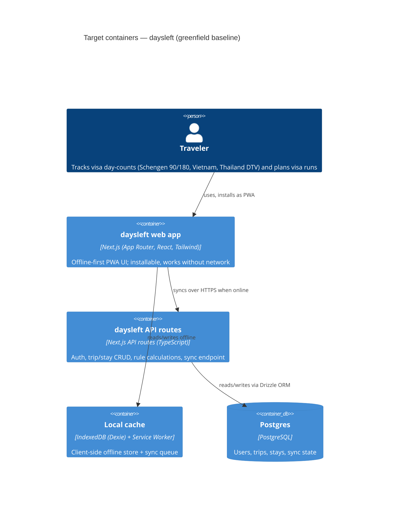

# Architecture map — daysleft

> **Greenfield foundation** — the target baseline chosen with the user before any code exists.
> `scaffold` materializes this into a real skeleton; `survey` re-runs in brownfield mode afterward
> to confirm the map still reflects reality. No authored architecture doc exists yet.

## Stack

- Language / runtime: TypeScript on Node.js 20+, single Next.js app (App Router) for both frontend and backend (API routes)
- Frameworks: Next.js 14+, React, Tailwind CSS, Drizzle ORM, Auth.js (NextAuth)
- Datastore: PostgreSQL (managed instance, e.g. Neon/Supabase/RDS — hosting choice deferred to deployment, not architecture)
- Offline layer: service worker (PWA) + IndexedDB (Dexie) as the client-side cache/queue that syncs to the API when online
- Build / test / lint: `npm run build` (next build) / `npm run test` (Vitest unit) + `npm run test:e2e` (Playwright) / `npm run lint` (eslint + tsc --noEmit)

## C4 — system as it is

## Module inventory

<!-- target layout, not yet materialized; scaffold creates these paths -->

| Module | Path | Layers | Wired at | Responsibility |
|---|---|---|---|---|
| trips | `src/modules/trips/` | ui / app / data | `src/app/(app)/trips/` | Manage trips/stays (entries + edits) |
| rules | `src/modules/rules/` | domain / app | consumed by `trips`, `dashboard` | Schengen 90/180, Vietnam, Thailand DTV day-count logic |
| dashboard | `src/modules/dashboard/` | ui / app | `src/app/(app)/page.tsx` | Days-left summary + visa-run planning view |
| auth | `src/modules/auth/` | app / infra | `src/app/api/auth/[...nextauth]/` | Auth.js session + account management |
| sync | `src/modules/sync/` | app / infra | `src/app/api/sync/` | Reconciles offline queue with server state |
| db | `src/db/` | infra | `src/db/schema.ts` | Drizzle schema + migrations |

## Conventions (cited — the rules a new feature must match)

<!-- foundational picks; no code yet, so no citations — scaffold will materialize these and later
survey runs will cite real files. -->

- **Module wiring / registration:** feature-first modules under `src/modules/<name>/`, each owning its own UI, app logic, and data access — no shared "components/services/hooks" grab-bag folders
- **Error handling:** unified error envelope `{ error: { code, message } }` returned from all API routes; thrown `AppError` subclasses mapped to it at the route boundary
- **IDs:** UUIDv7 generated app-side (time-sortable, safe for offline-created records to merge on sync)
- **Persistence / DB access:** Drizzle ORM only, no raw SQL outside `src/db/`; DB treated as dumb storage — domain logic stays in modules
- **Migrations:** `drizzle-kit` generated migrations under `drizzle/`, one migration per schema change, forward + down
- **Tests:** Vitest for unit/component tests colocated as `*.test.ts(x)` next to source; Playwright e2e under `e2e/`, including an offline-mode simulation suite
- **Inter-module communication:** direct TypeScript imports within the app; `sync` module is the only one crossing the offline/online boundary
- **UI / styling:** Tailwind CSS utility classes; shared primitives live in `src/modules/ui/` (to be established as feature work begins) — no CSS-in-JS, no component library import until a design system is chosen (see `sdd:design-system`)

## Datastores

| Store | Engine | Accessed via | Notes |
|---|---|---|---|
| Primary DB | PostgreSQL | Drizzle ORM (`src/db/`) | Source of truth: users, trips, stays, sync state |
| Local cache | IndexedDB (Dexie) | `src/modules/sync/local/` | Offline read/write queue, mirrors a subset of Postgres schema |

## Frontend / UI foundation

- **Component library / design system:** none yet — not decided; run `sdd:design-system` before the first UI feature
- **Design tokens:** Tailwind config (`tailwind.config.ts`, to be created by scaffold) will hold the initial token source
- **Styling approach:** Tailwind CSS (utility-first)
- **Shared primitives:** none yet — first feature establishes the initial set in `src/modules/ui/`
- **State / data-fetching:** React Server Components + Next.js server actions for server data; Dexie live-queries for offline client state; no separate global client store planned unless a feature proves the need
- **Closest UI precedent:** N/A — first feature sets the precedent

## Where things live / closest precedents

- A new visa-rule type (e.g. a new country's day-count rule) → `src/modules/rules/`, modelled on the Schengen 90/180 rule once it exists
- A new screen / UI component → `src/modules/<feature>/`, composed from `src/modules/ui/` primitives once established (§Frontend)
- A new API endpoint → `src/app/api/<resource>/route.ts`, following the unified error envelope convention

## Constraints & known tech-debt

- No code exists yet — this map describes the target, not the current state; `scaffold` must materialize it before any feature work begins
- Offline-first sync (`sync` module) is the highest-risk piece architecturally — conflict resolution strategy (e.g. last-write-wins vs. field-level merge) is deferred to a dedicated ADR when the `sync` feature is designed, not decided here
- Hosting for PostgreSQL is unspecified — deployment target does not change the architecture and is out of scope for this map

## Reconciliation with the authored architecture doc

No authored architecture doc exists; this map is the foundation baseline and becomes the current reference once `scaffold` materializes it.
