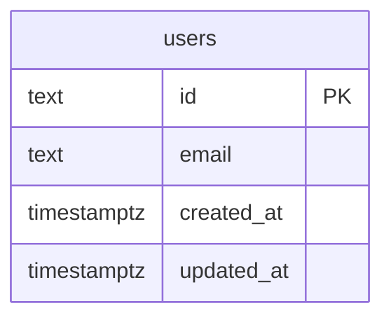

# Data model — auth-user-plus-dashboard

## ER diagram

<!-- Single entity, no FKs in this slice. Clerk is the system of record for sessions and
magic-links (sad.md §4 ADR-0001) — no local session/magic-link table. Dashboard ships as an
empty-state shell (spec §3 non-goal) — no dashboard-owned data yet. i18n is a static message
catalog file (src/lib/i18n/en.json), not a DB table (sad.md §5/§8). Future features (trips, rules)
will FK to users(id) — out of this slice's scope. -->

## Entities

### `users`

The local shadow of a Clerk account, kept in sync by the Clerk webhook (sad.md §4, §6 flows 1/3/4).

| Column | Type | Constraints | Notes |
|---|---|---|---|
| `id` | TEXT | PK | The Clerk-issued user id itself — already globally unique, so no separate app-generated id (sad.md §8, explicit override of the repo's default UUIDv7-app-side convention for this table) |
| `email` | TEXT | NOT NULL, UNIQUE | The verified email Clerk returned (OAuth-verified or magic-link-confirmed); enforces account uniqueness (spec §5 AC-03, §7 duplicate-account-count monitor target 0) |
| `created_at` | TIMESTAMPTZ | NOT NULL DEFAULT now() | Row creation (first sign-in, sad.md §6 flow 1/3/4 webhook upsert) |
| `updated_at` | TIMESTAMPTZ | NOT NULL DEFAULT now() | Bumped on every webhook sync (Clerk user-updated events) |

**Aggregate root:** `users` is its own root — the only entity in this slice (confirmed: single-aggregate scope, per sad.md §5 building blocks — no other persistence container is defined).
**Access patterns:**
- Webhook upsert by Clerk user id (sad.md §6 flows 1, 3, 4: "webhook — user created or matched by verified email") → served by the PK index on `id`.
- Duplicate-account monitor / account-uniqueness check (spec §7, §5 AC-03) → served by the UNIQUE index on `email`.
- §11 risk mitigation (synchronous create-or-fetch fallback if the webhook lags) → also served by the UNIQUE index on `email`.

**Constraints:** UNIQUE on `email`; no FKs (no other table references or is referenced by `users` in this slice).

<!-- created_at/updated_at, hard-delete, and TEXT for email were confirmed with the user — no repo
convention exists yet to detect from (greenfield, no code). PK type is NOT a fresh choice here: it
follows sad.md §8's explicit override, backed by ADR-0001. -->

## Indexes

| Index | Columns | Query it serves |
|---|---|---|
| `users_pkey` (implicit, PK) | `id` | Webhook upsert by Clerk user id (sad.md §6 flows 1/3/4); future FK joins from `trips`/`rules` |
| `users_email_key` (implicit, UNIQUE) | `email` | Account-linking match / duplicate-account monitor (spec §5 AC-03, §7); §11 create-or-fetch fallback lookup |

<!-- No additional indexes: both access patterns are already served by the PK and the UNIQUE
constraint's automatic Postgres index — no "just in case" index added. -->

## Test fixtures

- `newTestUser(overrides?)` — builds a `users` row with a deterministic UUID v7-shaped fake Clerk id (`user_test_<uuid>`) and `user-<uuid>@example.test` email; accepts overrides for account-linking / duplicate-email test scenarios (AC-03, AC-03b).
