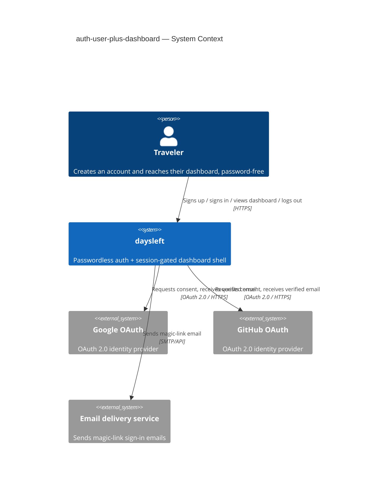
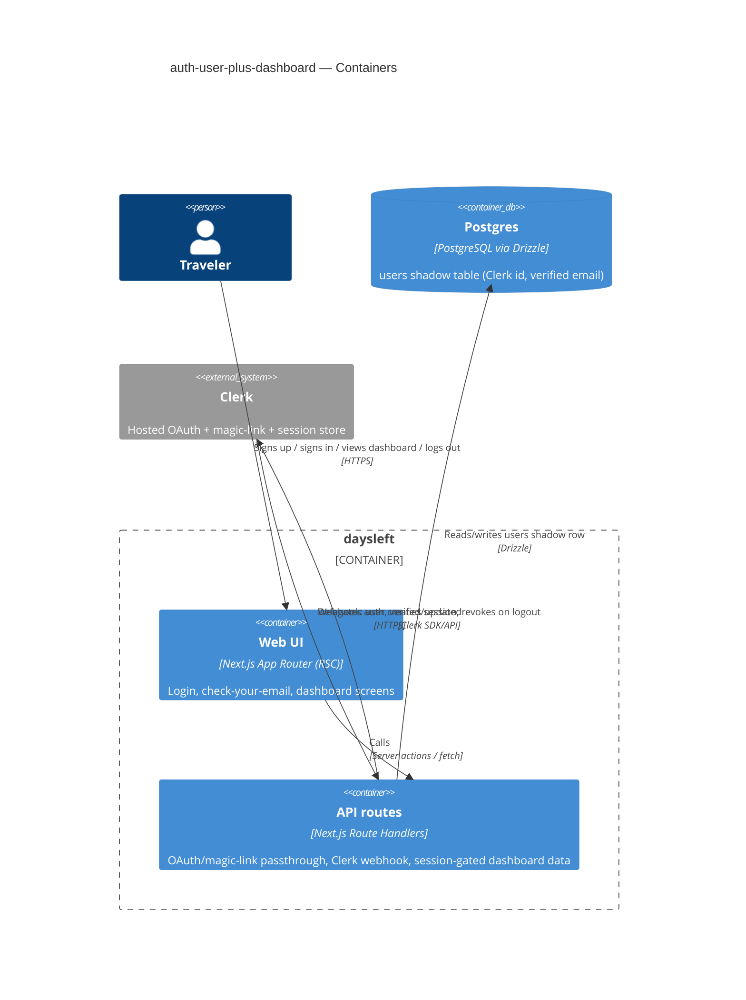

# Software Architecture Document — auth-user-plus-dashboard

<!-- 12 Arc42 sections. Empty section → <!-- N/A: <one-line reason> -->. -->
<!-- C4 Context (L1) lives inline in §3. C4 Container (L2) lives inline in §5. -->
<!-- Numbers in §10 come VERBATIM from spec.md §6 NFR — no inventing, no rounding. -->

## 1. Introduction and goals

**Intent.** Delivers the first user-facing vertical slice of daysleft: passwordless account creation (Google/GitHub OAuth or magic-link email) with account-linking by verified email, a session-gated dashboard shell, complete server-side logout, and a minimal i18n foundation. Establishes the auth boundary and dashboard route every future trip/day-count feature builds on.

**Top-3 quality goals (1-liners; full scenarios in §10):**

1. Security of the first authentication boundary — no open redirect, no duplicate accounts, complete server-side logout (spec §6.1)
2. Latency of the auth handoff (≤300ms p95) and first dashboard render (≤500ms p95) (spec §6)
3. Availability of the login/dashboard path (99.5% SLO) — the foundation every later feature depends on

**Stakeholders.**

| Role | Interest | Sign-off owner? |
|---|---|---|
| Traveler | signs up, signs in, uses the dashboard | No |
| Tech Lead | SAD approval | Yes |
| Security Lead | security review sign-off (spec §6.1: required — first auth boundary + first PII collection) | Yes |

## 2. Constraints

**Technical.**
- TypeScript on Node.js 20+
- Next.js 14+ (App Router), React, Tailwind CSS
- PostgreSQL, accessed via Drizzle ORM
- Architecture convention: feature-first modules under `src/modules/<name>/` (ui / app / data layers), no shared "components/services/hooks" grab-bag folders (architecture-map.md)

**Organisational.**
- Deadline / effort budget / team composition — not yet set by PM (TBD; see §11 risk row)

**Conventions.**
- `docs/architecture-map.md` §Conventions
- Unified error envelope `{ error: { code, message } }`; UUIDv7 IDs generated app-side; Drizzle-only persistence, no raw SQL outside `src/db/`; Vitest (unit) + Playwright (e2e)

**Regulatory / external.**
- No named compliance regime (e.g. no GDPR/HIPAA scope stated in spec)
- Security review required before ship (spec §6.1) — first authentication boundary and first PII collection in the app (email, OAuth provider account identifier, session token, browser-reported locale)

## 3. Context and scope

daysleft is a visa/travel day-count tracker. A Traveler creates an account and reaches a private dashboard using passwordless authentication (Google, GitHub, or a magic-link email) — never a password. The system verifies identity via external OAuth providers or a self-issued magic-link email, then serves a session-gated dashboard from its own origin.

<!-- brownfield: N/A — greenfield repo, no code exists yet (architecture-map.md) -->

**External systems (in / out):**

| Actor or system | Type | Interaction |
|---|---|---|
| Traveler | Person | Authenticates, views the dashboard, logs out |
| Google OAuth | System (external) | Provides OAuth 2.0 consent + a verified email address |
| GitHub OAuth | System (external) | Provides OAuth 2.0 consent + a verified email address |
| Email delivery service | System (external) | Sends magic-link sign-in emails to the Traveler (mechanism decided in §4) |

**C4 Context (L1):**



## 4. Solution strategy

**Target surface(s):** `backend-service` + `web-frontend` — inherited from `architecture-map.md` (one Next.js deployable, drawn as two logical C4 containers). No ADR (pre-decided at `survey`, not a fresh choice for this feature).

**UI architecture (web-frontend):** Hybrid SSR + React Server Components, no global client-state library — RSC reads the session directly server-side; client components only where interactivity is needed (e.g. the magic-link resend button). Matches `architecture-map.md` §Frontend verbatim. No ADR (low blast radius at this scale).

**Top strategic choices (the seeds for ADRs):**

1. **Passwordless auth via Clerk (ADR-0001)** — Clerk is the hosted identity provider for Google OAuth, GitHub OAuth, and magic-link email, and is the system of record for accounts/sessions. Chosen for full server-side session revocation (AC-06) and account-linking by verified email (AC-03) without hand-writing that surface, given the mandatory security review on the app's first auth boundary (spec §6.1).
2. **Local `users` shadow table, synced by Clerk webhook** — our own Postgres holds a minimal shadow row (Clerk user id, verified email) so future features (`trips`, `rules`) can foreign-key to a local id without calling out to Clerk. A direct consequence of ADR-0001; kept inline as a building-block decision (§5), not a separate ADR.
3. **Magic-link rate-limiting delegated to Clerk** — spec §6's exact NFR (≤5 sends/email/hour, verified in tests) is satisfied by Clerk's own internal throttling rather than an app-level counter, trading verifiability for zero extra code. Flagged as a §11 risk since Clerk's exact threshold is not independently confirmed or testable by us.
4. **No new cache tier, no concurrency-control beyond the database's own** — this slice has no concurrent-write contention scenario (account creation is upserted by verified email, session reads are single-row lookups); Postgres's default read-committed behavior is sufficient. Revisit only if a future feature proves the need.

Each tactical decision in later sections should trace to one of these seeds. Tactical decisions that *contradict* a strategic choice are red flags — surface them in §11.

## 5. Building block view

Feature-first modules per `architecture-map.md`'s convention: `auth` owns the Clerk integration, the `users` shadow table, session-read helpers, and the login/check-your-email/magic-link-invalid screens; `dashboard` owns the empty-state shell and header logout. Each module keeps `ui` / `app` / `data(infra)` / `ports` layers, no shared grab-bag folder. The i18n message catalog + `translate()` helper is cross-cutting infrastructure, not business logic, so it lives outside both modules.

**Internal decomposition:**

```
src/modules/auth/
├── app/          # session-read helpers, account-linking use case, webhook-sync use case
├── infra/        # Drizzle repository for the `users` shadow table, Clerk SDK wiring
├── ports/        # Next.js route handlers: OAuth/magic-link passthrough, Clerk webhook endpoint
└── ui/           # SCR-01 Login, SCR-02 Check your email, SCR-04 Magic-link invalid

src/modules/dashboard/
├── app/          # dashboard view-model / empty-state use case
├── ports/        # session-gated dashboard route handler
└── ui/           # SCR-03 Dashboard shell + header logout

src/lib/i18n/     # message catalog (en.json) + translate() helper — cross-cutting, not a business module
```

**C4 Container (L2):**



## 6. Runtime view

## 7. Deployment view

## 8. Crosscutting concepts

## 9. Architecture decisions

## 10. Quality requirements

## 11. Risks and technical debt

## 12. Glossary
