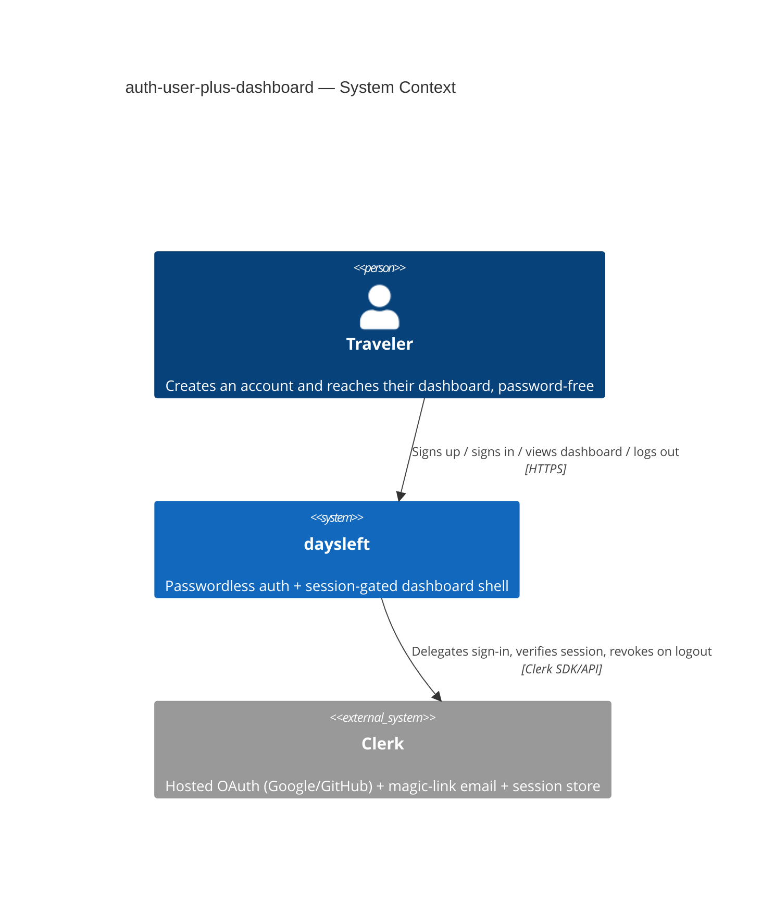
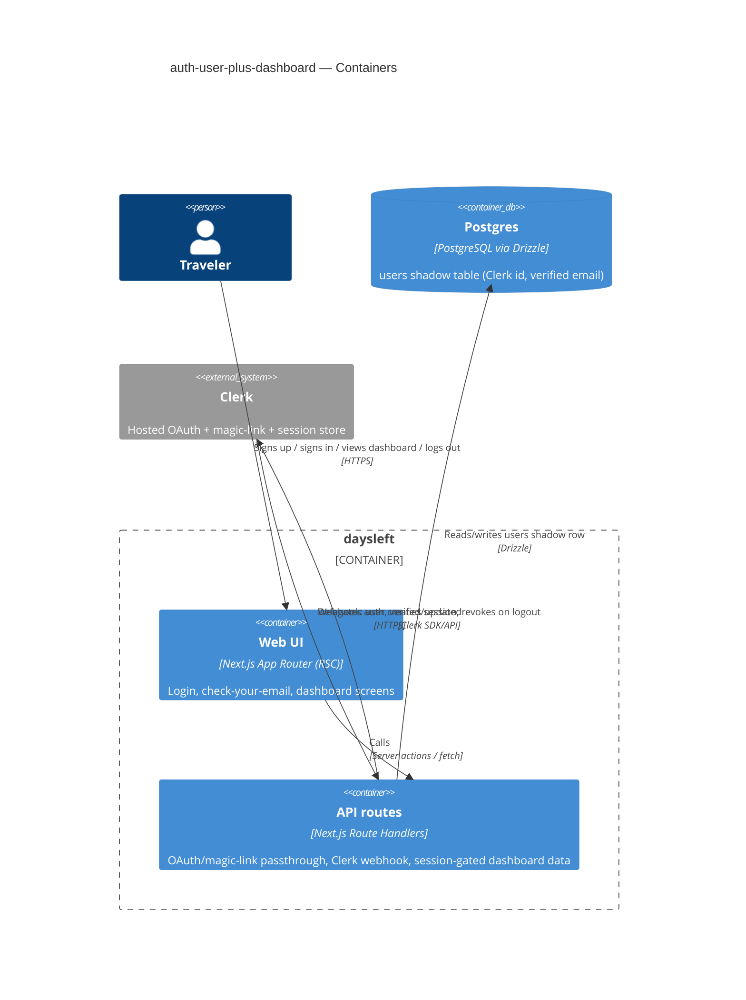
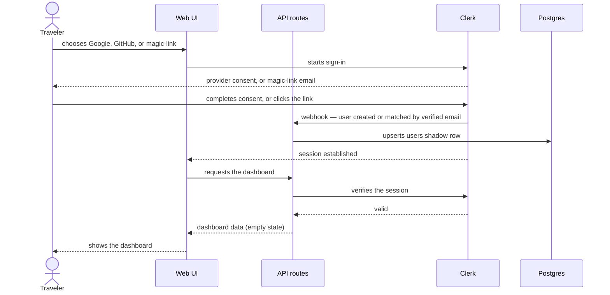
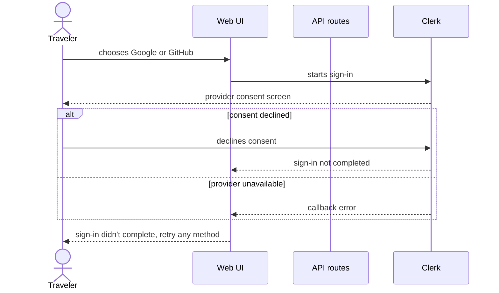
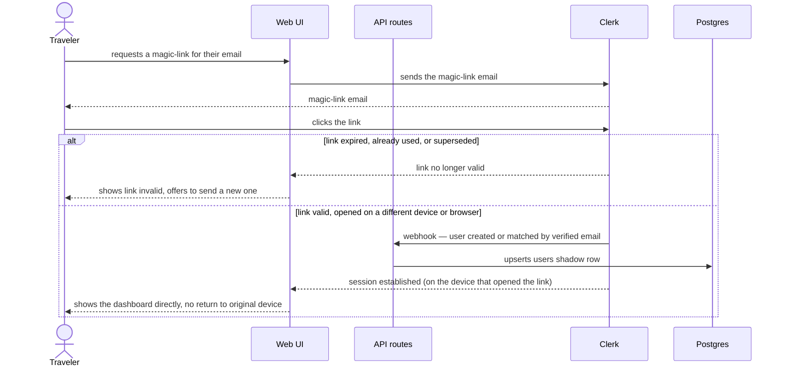
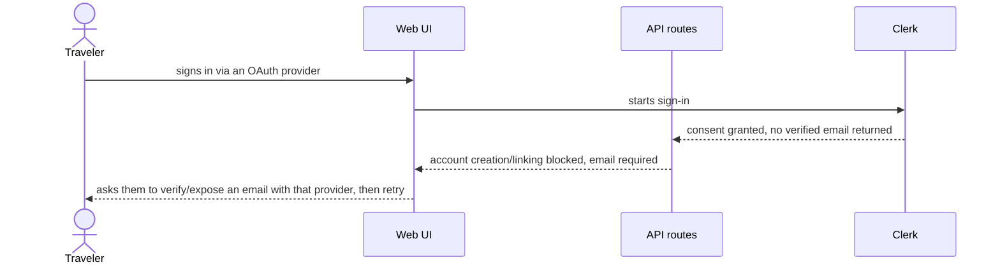
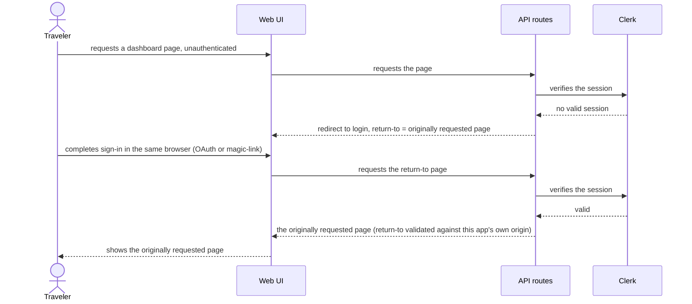
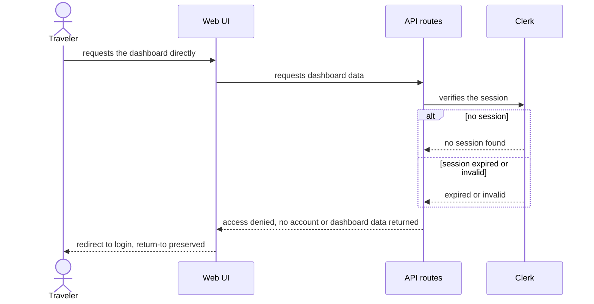
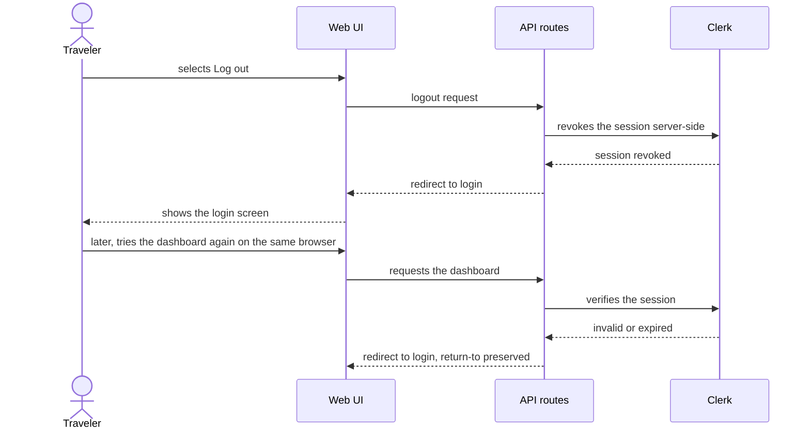

# Software Architecture Document — auth-user-plus-dashboard

<!-- 12 Arc42 sections. Empty section → <!-- N/A: <one-line reason> -->. -->
<!-- C4 Context (L1) lives inline in §3. C4 Container (L2) lives inline in §5. -->
<!-- Numbers in §10 come VERBATIM from spec.md §6 NFR — no inventing, no rounding. -->

## 1. Introduction and goals

**Intent.** Delivers the first user-facing vertical slice of daysleft: passwordless account creation (Google/GitHub OAuth or magic-link email) with account-linking by verified email, a session-gated dashboard shell, complete server-side logout, and a minimal i18n foundation. Establishes the auth boundary and dashboard route every future trip/day-count feature builds on.

**Top-3 quality goals (1-liners; full scenarios in §10):**

1. Security of the first authentication boundary — no open redirect, no duplicate accounts, complete server-side logout (spec §6.1)
2. Latency of the auth handoff (≤300ms p95) and first dashboard render (≤500ms p95) (spec §6)
3. Availability of the login/dashboard path (99.5% SLO) — the foundation every later feature depends on

**Stakeholders.**

| Role | Interest | Sign-off owner? |
|---|---|---|
| Traveler | signs up, signs in, uses the dashboard | No |
| Tech Lead | SAD approval | Yes |
| Security Lead | security review sign-off (spec §6.1: required — first auth boundary + first PII collection) | Yes |

## 2. Constraints

**Technical.**
- TypeScript on Node.js 20+
- Next.js 14+ (App Router), React, Tailwind CSS
- PostgreSQL, accessed via Drizzle ORM
- Architecture convention: feature-first modules under `src/modules/<name>/` (ui / app / data layers), no shared "components/services/hooks" grab-bag folders (architecture-map.md)

**Organisational.**
- Deadline / effort budget / team composition — not yet set by PM (TBD; see §11 risk row)

**Conventions.**
- `docs/architecture-map.md` §Conventions
- Unified error envelope `{ error: { code, message } }`; UUIDv7 IDs generated app-side; Drizzle-only persistence, no raw SQL outside `src/db/`; Vitest (unit) + Playwright (e2e)
- **Override:** `architecture-map.md` named Auth.js/NextAuth as the auth approach and planned `auth` as `app`/`infra` layers only (no `ui`, assuming a library's built-in pages). Superseded by ADR-0001 (§4): Clerk is the auth solution, and `auth` gains a `ui` layer since its screens (SCR-01/02/04) are composed with our own design canon (`docs/design-system.md`) rather than a library's built-in pages. `architecture-map.md` should be refreshed via `survey` after this feature ships.
- UI foundation: `docs/design-system.md` (tool: code, established) — SCR-01…04 compose from its component inventory, currently empty (first UI feature).

**Regulatory / external.**
- No named compliance regime (e.g. no GDPR/HIPAA scope stated in spec)
- Security review required before ship (spec §6.1) — first authentication boundary and first PII collection in the app (email, OAuth provider account identifier, session token, browser-reported locale)

## 3. Context and scope

daysleft is a visa/travel day-count tracker. A Traveler creates an account and reaches a private dashboard using passwordless authentication (Google, GitHub, or a magic-link email) — never a password. The system verifies identity via external OAuth providers or a self-issued magic-link email, then serves a session-gated dashboard from its own origin.

<!-- brownfield: N/A — greenfield repo, no code exists yet (architecture-map.md) -->

**External systems (in / out):**

| Actor or system | Type | Interaction |
|---|---|---|
| Traveler | Person | Authenticates, views the dashboard, logs out |
| Clerk | System (external) | Hosted identity provider — brokers Google/GitHub OAuth consent, sends magic-link emails, and holds the session record (ADR-0001) |

<!-- Google OAuth and GitHub OAuth are reached via Clerk, not directly by daysleft — outside this system's boundary since ADR-0001 (§4). -->

**C4 Context (L1):**



## 4. Solution strategy

**Target surface(s):** `backend-service` + `web-frontend` — inherited from `architecture-map.md` (one Next.js deployable, drawn as two logical C4 containers). No ADR (pre-decided at `survey`, not a fresh choice for this feature).

**UI architecture (web-frontend):** Hybrid SSR + React Server Components, no global client-state library — RSC reads the session directly server-side; client components only where interactivity is needed (e.g. the magic-link resend button). Matches `architecture-map.md` §Frontend verbatim. No ADR (low blast radius at this scale).

**Top strategic choices (the seeds for ADRs):**

1. **Passwordless auth via Clerk (ADR-0001)** — Clerk is the hosted identity provider for Google OAuth, GitHub OAuth, and magic-link email, and is the system of record for accounts/sessions. Chosen for full server-side session revocation (AC-06) and account-linking by verified email (AC-03) without hand-writing that surface, given the mandatory security review on the app's first auth boundary (spec §6.1).
2. **Local `users` shadow table, synced by Clerk webhook** — our own Postgres holds a minimal shadow row (Clerk user id, verified email) so future features (`trips`, `rules`) can foreign-key to a local id without calling out to Clerk. A direct consequence of ADR-0001; kept inline as a building-block decision (§5), not a separate ADR.
3. **Magic-link rate-limiting delegated to Clerk** — spec §6's exact NFR (≤5 sends/email/hour, verified in tests) is satisfied by Clerk's own internal throttling rather than an app-level counter, trading verifiability for zero extra code. Flagged as a §11 risk since Clerk's exact threshold is not independently confirmed or testable by us.
4. **No new cache tier, no concurrency-control beyond the database's own** — this slice has no concurrent-write contention scenario (account creation is upserted by verified email, session reads are single-row lookups); Postgres's default read-committed behavior is sufficient. Revisit only if a future feature proves the need.

Each tactical decision in later sections should trace to one of these seeds. Tactical decisions that *contradict* a strategic choice are red flags — surface them in §11.

## 5. Building block view

Feature-first modules per `architecture-map.md`'s convention: `auth` owns the Clerk integration, the `users` shadow table, session-read helpers, and the login/check-your-email/magic-link-invalid screens; `dashboard` owns the empty-state shell and header logout. Each module keeps `ui` / `app` / `data(infra)` / `ports` layers, no shared grab-bag folder. The i18n message catalog + `translate()` helper is cross-cutting infrastructure, not business logic, so it lives outside both modules.

**Internal decomposition:**

```
src/modules/auth/
├── app/          # session-read helpers, account-linking use case, webhook-sync use case
├── infra/        # Drizzle repository for the `users` shadow table, Clerk SDK wiring,
                   # and the Next.js route handlers (OAuth/magic-link passthrough, Clerk webhook)
└── ui/           # SCR-01 Login, SCR-02 Check your email, SCR-04 Magic-link invalid — NEW vs.
                   # architecture-map.md's original app/infra-only plan (§2 override, Clerk screens)

src/modules/dashboard/
├── app/          # dashboard view-model / empty-state use case, incl. the session-gated route handler
└── ui/           # SCR-03 Dashboard shell + header logout

src/lib/i18n/     # message catalog (en.json) + translate() helper — cross-cutting, not a business module
```

**C4 Container (L2):**



## 6. Runtime view

**Critical flow 1: Sign in and reach the dashboard (US-01/US-02 happy path)**



**Critical flow 2: OAuth sign-in fails (US-01, AC-01b)**



**Critical flow 3: Magic-link invalid, or completed on a different device (US-01, AC-02/AC-02b)**



**Critical flow 4: Account-linking blocked — no verified email from provider (US-02, AC-03b)**



**Critical flow 5: Return to the originally requested page after login (US-03, AC-04)**



**Critical flow 6: Unauthenticated dashboard access denied (US-04, AC-05)**



**Critical flow 7: Complete server-side logout (US-05, security quality goal)**



<!-- AC-07 (empty dashboard, US-06): covered by Flow 1's "dashboard data (empty state)" step — no dedicated flow needed. -->
<!-- AC-08 (i18n render, US-07): N/A — client-side locale render on every screen, not a distinct service call or runtime path. -->

## 7. Deployment view

Single Next.js deployable (§5), horizontally scaled behind a load balancer. Requests are stateless per-instance — session state lives in Clerk, not in-process — so any instance can serve any request; no sticky sessions needed. Exact replica count / hosting target is an ops decision outside this SAD's scope (`architecture-map.md` leaves Postgres/app hosting unspecified).

**Monitoring:**
- Metrics: server timing metric on sign-in initiation (spec §6 auth-handoff NFR); client navigation timing on dashboard first render; duplicate-account count per verified email (target 0, spec §6)
- Alerts: auth-handoff p95 > 300ms → page on-call; dashboard first-render p95 > 500ms → page on-call; synthetic uptime probe failure on the login page → page on-call (99.5% SLO, spec §6)
- Tracing: spans on the API route boundary (sign-in initiation, dashboard data fetch, logout)

**Scaling thresholds:**
- No concrete threshold yet — spec §6 states only a floor (≥5 req/s per instance); add a real scale-up trigger once production traffic data exists

## 8. Crosscutting concepts

| Concept | Convention | Where defined |
|---|---|---|
| Logging | Structured, fields `module=<name>` | `architecture-map.md` §Conventions |
| Authentication | Clerk-issued session, verified server-side via the Clerk SDK on every protected request | §4 ADR-0001 |
| Error handling | Unified error envelope `{ error: { code, message } }`; AC-01b/AC-02/AC-03b each map to a distinct error code | `architecture-map.md` §Conventions |
| ID strategy | New daysleft entities use UUIDv7 (repo convention); the `users` shadow table's primary key is the Clerk-issued user id itself (already globally unique — avoids a redundant mapping table). Finalized in `data-model`. | here |
| Internationalisation | Message catalog `src/lib/i18n/en.json` + a `translate(key)` helper reading the browser's `Accept-Language`, falling back to English (AC-08); no locale-prefixed routing, no per-locale date/number/currency formatting (spec non-goals) | §5, spec §3 |
| Observability | Tracing spans at the API route boundary | §7 |
| Events | N/A — no internal event bus in this feature; the Clerk webhook is inbound HTTP, not an internal event | — |
| Rate-limiting | Magic-link send rate delegated to Clerk's internal throttling (§4); when Clerk rejects a send for hitting its throttle, our API route surfaces that as a distinct error code in the unified error envelope, which SCR-02 renders as "too many requests, try again later" (spec §6.1: never a silent success or failure) — the SCR-02 rate-limited state itself is added when `screens` runs. Flagged as a §11 risk. | §4, §11 |

## 9. Architecture decisions

| # | Title | Status | Section |
|---|---|---|---|
| 0001 | Use Clerk for passwordless auth | Accepted | §4 |

ADR files live under `docs/features/auth-user-plus-dashboard/adr/NNNN-<title>.md`.

## 10. Quality requirements

Each top-3 goal from §1 expanded into a full scenario:

**QG-1. Security of the first authentication boundary**
- **When:** a Traveler completes sign-in via any method, logs out, or a stale/invalid session tries to reach the dashboard
- **Then:** account uniqueness holds (0 duplicate accounts per verified email); logout ends the session server-side so the dashboard is unreachable from that browser without signing in again (AC-06); any return-to destination is validated against the app's own origin — no open redirect (spec §6.1)
- **How verify:** integration tests asserting (a) two sign-ins with the same verified email via different methods resolve to one account, (b) a dashboard request after logout on the same session is denied, (c) an off-origin return-to param is rejected; the duplicate-account-count monitor (§7) targets 0

**QG-2. Latency of the auth handoff and first dashboard render**
- **When:** a Traveler starts sign-in, or completes auth and lands on the dashboard
- **Then:** server timing on sign-in initiation ≤ 300 ms p95; client navigation timing on dashboard first render (post-auth) ≤ 500 ms p95 (spec §6)
- **How verify:** the §7 server-timing and client-navigation-timing metrics tracked against these p95 targets; a CI smoke test asserting ≥ 5 req/s per instance on the combined auth-handoff + dashboard-render endpoints (spec §6 throughput row)

**QG-3. Availability of the login/dashboard path**
- **When:** ongoing, any time
- **Then:** 99.5% uptime over a monthly SLO window (spec §6)
- **How verify:** the §7 synthetic uptime probe against the login page, monthly SLO window

## 11. Risks and technical debt

<!-- brownfield gotchas: N/A — greenfield repo, no code exists yet -->

| Risk / debt | Severity | Mitigation | Owner |
|---|---|---|---|
| Deadline / effort budget / team composition not yet set (§2) | Low | PM sets these before `implement` starts | PM |
| Magic-link send-rate NFR (≤5/email/hour, spec §6) is delegated to Clerk's own internal throttling, whose exact threshold we haven't independently confirmed | Medium | Confirm Clerk's actual throttle via their docs/support before ship; if it diverges from ≤5/hour, add an app-level Postgres-backed counter or patch spec §6's wording | Tech Lead |
| Clerk outage/incident directly affects login/dashboard availability (99.5% SLO) — a dependency outside our control (ADR-0001) | Medium | Monitor Clerk's status page; define an incident playbook; consider a status-page banner as a user-facing fallback | Tech Lead |
| A missed or delayed Clerk webhook leaves the local `users` shadow table stale — a dashboard request could arrive before the shadow row exists | Medium | Add a synchronous create-or-fetch fallback on the first authenticated request (in addition to the webhook), so AC-01's "creates one on first use" doesn't depend solely on webhook timing | Backend |

**Accepted debt (acceptable in v1, plan to fix later):**
- Exact Postgres/app hosting target is undecided (§7) — an ops decision deferred past this SAD, not a v1 blocker.
- No app-level enforcement of the exact magic-link rate limit — accepted for v1 pending the Clerk-throttle confirmation above.

## 12. Glossary

| Term | Meaning |
|---|---|
| Traveler | A person who signs up to track their own visa day-counts; one account = one traveler, no multi-user/org concept (CONTEXT.md) |
| Magic-link | A single-use, time-limited (≤15 min) sign-in link emailed to a Traveler in place of a password |
| Account-linking | Matching a new sign-in method to an existing account by verified email, so one person never ends up with two accounts (spec AC-03) |
| `users` shadow table | The local Postgres table holding a minimal mirror of Clerk's account record (Clerk user id + verified email), kept in sync by webhook, so other daysleft modules can foreign-key to a local id |
| Return-to destination | The page a Traveler was trying to reach before being redirected to login; restored after sign-in, validated to share the app's own origin (spec §6.1) |
| Session | The server-side record of a signed-in Traveler, held and revocable by Clerk; ends immediately on logout, not just a client cookie clear (AC-06) |
