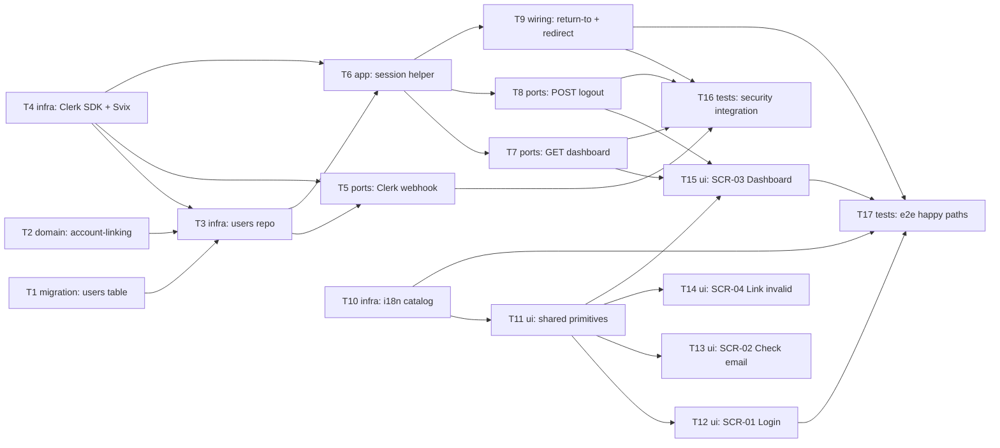

# Epic — auth-user-plus-dashboard

> **Spec:** [spec.md](../spec.md) · **Design:** [sad.md](../sad.md) · **Data model:** [data-model.md](../data-model.md) · **API:** [openapi.yaml](../contracts/openapi.yaml) · **Screens:** [screens.md](../screens.md) · **ADRs:** [adr/](../adr/)

## Goal

Ship daysleft's first user-facing vertical slice: passwordless sign-up/sign-in (Google, GitHub, magic-link) via Clerk with account-linking by verified email, a session-gated dashboard shell with complete server-side logout, and a minimal i18n foundation (spec §2).

## Scope

- **In:** `auth` module (Clerk webhook sync, session helpers, logout, SCR-01/02/04 UI), `dashboard` module (session-gated data + SCR-03 shell), the `users` shadow table + migration, the cross-cutting i18n catalog, integration + e2e tests for the security/happy-path scenarios.
- **Out (spec §3):** password login, multi-role support, populated dashboard content, additional locales, locale-aware formatting, cross-device logout, offline behavior.

## Task map

## Tasks

See [tracker.md](./tracker.md) for status. Machine contract: [tasks.json](../tasks.json).

| # | Task | Layer | Blocked by | DoD (short) |
|---|---|---|---|---|
| T1 | Promote staged users migration to live | migration | — | migration applies + reverts cleanly |
| T2 | Account-linking invariant (pure fn) | domain | — | unit tests: same email → one account |
| T3 | Drizzle users repository | infra | T1, T2 | findByEmail/findById/upsert integration-tested |
| T4 | Clerk SDK + Svix verification wiring | infra | — | signature verify unit-tested |
| T5 | Clerk webhook route handler | ports | T3, T4 | 200/401/422 + dedupe per contract |
| T6 | Session-read helper + create-or-fetch fallback | app | T3, T4 | valid/expired/missing session all typed |
| T7 | GET /api/v1/dashboard handler | ports | T6 | 200 empty-state / 401 with return_to |
| T8 | POST /api/v1/auth/logout handler | ports | T6 | 204 revoke, subsequent request 401 |
| T9 | Return-to origin validation + redirect | wiring | T6 | off-origin return-to discarded |
| T10 | i18n message catalog + translate() | infra | — | fallback-to-English unit-tested |
| T11 | Shared UI primitives (8 components) | ui | T10 | component tests + design-system registration |
| T12 | SCR-01 Login, 5 states | ui | T11 | all 5 states component-tested |
| T13 | SCR-02 Check your email, 4 states | ui | T11 | all 4 states component-tested |
| T14 | SCR-04 Magic-link invalid, 3 states | ui | T11 | all 3 states component-tested |
| T15 | SCR-03 Dashboard, 2 states | ui | T7, T8, T11 | states tested, logout wired |
| T16 | Security integration tests (QG-1) | tests | T5, T7, T8, T9 | uniqueness / post-logout / open-redirect |
| T17 | e2e happy-path tests | tests | T12, T15, T9, T10 | sign-up→dashboard, return-to, empty state, i18n fallback |

## Risks / Hard rules

- Magic-link send-rate NFR (≤5/email/hour) is delegated to Clerk's own throttling (sad.md §8, §11) — no app-level counter task exists; T13/T14's `error-rate-limited` state renders whatever error code Clerk's rejection maps to, it does not enforce the limit itself.
- T6's create-or-fetch fallback is required, not optional — sad.md §11 flags a missed/delayed webhook as a Medium risk; AC-01 ("creates one on first use") must not depend solely on webhook timing.
- Every new UI component (T11) must be registered in `docs/design-system.md` — the inventory is empty going in (first UI feature), so nothing here reuses an existing primitive.
- `users.id` is the Clerk-issued id itself, not an app-generated UUIDv7 (data-model.md, ADR-0001 override) — T2/T3 must not introduce a separate surrogate key.
