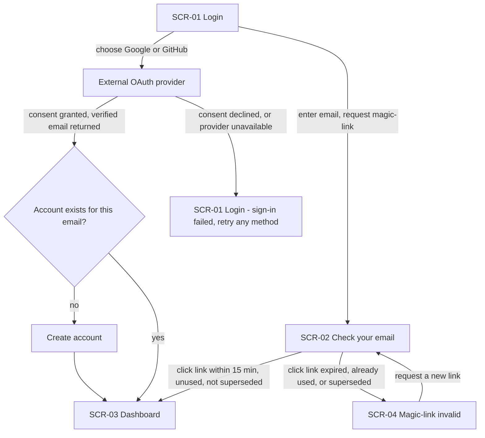
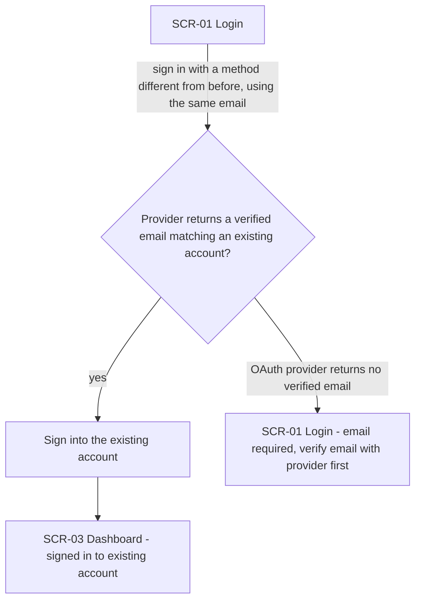
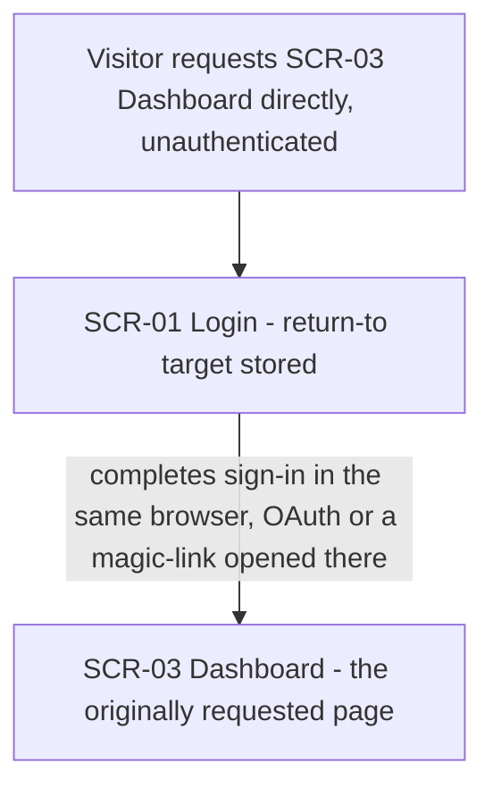
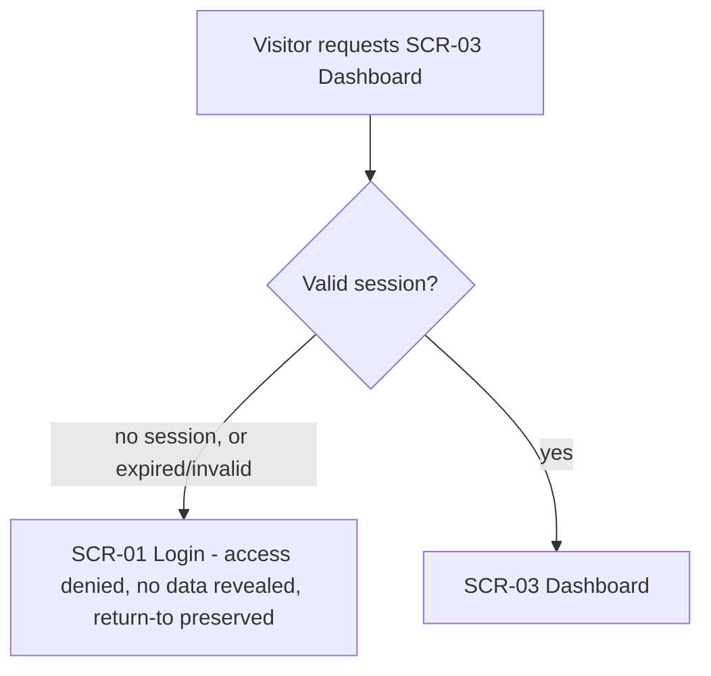
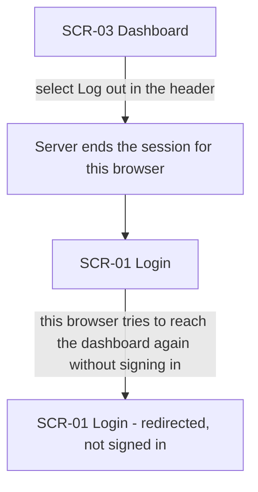
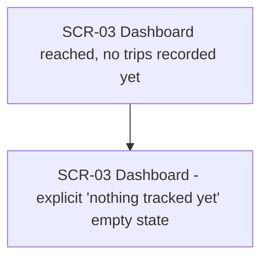
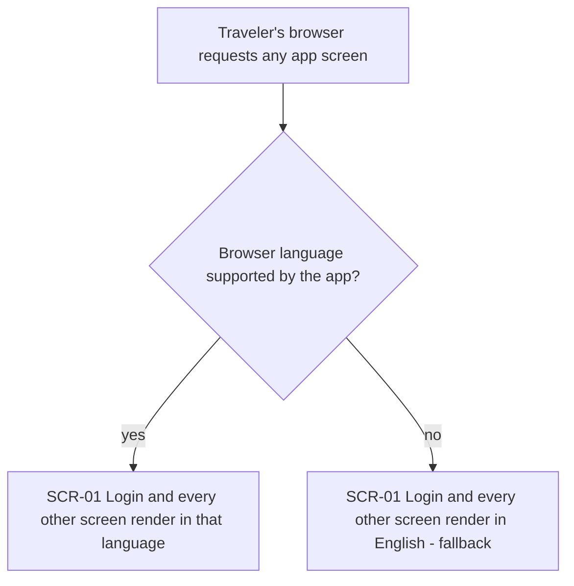

# UX flows — auth-user-plus-dashboard

> User flows for every UI-touching §4 user story, produced by `ux-flows` (after `clarify`, before
> `design`) and read by `design` (evidence for the target-surface + UI-architecture decisions),
> `sequences` (UI-driven flows align on SCR ids), `screens` (details every inventory row) and
> `plan-tests` (the e2e-through-UI paths). **Always markdown + mermaid `flowchart`**, whatever the
> design tool — this artifact is flow-altitude, not visual design.

## Platform decisions

- **Posture:** responsive-both — deviation from `docs/design-system.md` (absent — no design canon
  exists yet); assumed single responsive web app, confirmed with the user. Recommend running
  `/sdd:design-system` before `design` locks target surfaces.
- OAuth (Google, GitHub) hands off via a full-page redirect to the provider, not a dialog/popup —
  the return trip (consent granted or declined) lands back on this app's own origin.
- Magic-link sign-in is a single-page flow (email input → confirmation), not a multi-step wizard.
- Login and dashboard are both reached at the app's own origin; no separate marketing/landing site
  is in scope for this slice.
- Logout is a single header action with no confirmation dialog (server-side session end is fast and
  reversible by signing in again).

## Screen inventory

| ID | Screen | Purpose | Entry | Exit |
|---|---|---|---|---|
| SCR-01 | Login | Choose Google, GitHub, or magic-link email; shows sign-in errors | Direct visit, or redirected here from a protected route (return-to preserved) | External OAuth provider; SCR-02 (magic-link requested); SCR-03 (sign-in succeeds) |
| SCR-02 | Check your email | Confirms a magic-link was sent, offers resend | Submitting an email on SCR-01 | Clicking the emailed link (→ SCR-03 or SCR-04); back to SCR-01 |
| SCR-03 | Dashboard | Session-gated empty-state shell + header with logout | Successful sign-in (direct or return-to); direct visit with a valid session | Logout (→ SCR-01) |
| SCR-04 | Magic-link invalid | Tells the Traveler the link is expired/used/superseded, offers a new one | Clicking an expired, already-used, or superseded magic-link | Requesting a new link (→ SCR-02); navigating to SCR-01 |

## Flows

### Flow: US-01 — Sign up without a password

Happy path: the Traveler picks Google or GitHub, is redirected to the provider, and on granted consent with a verified email lands on the dashboard — an account is created silently on first use, or they're signed into the existing one. Picking magic-link instead takes them to a check-your-email screen; clicking a valid link within 15 minutes signs them straight into the dashboard. Two branches cover the errors: if the OAuth consent is declined or the provider is unavailable, they land back on login with a failure message and can retry any method (AC-01b); if the magic-link is expired, already used, or was superseded by a newer request, they land on the magic-link-invalid screen and can request a fresh one (AC-02). A link opened on a different device or browser than the one that requested it still completes sign-in straight to the dashboard, with no attempt to return to the original device (AC-02b) — that's the same "click link" edge in this diagram, just from a different browser.

### Flow: US-02 — Same account regardless of method

A Traveler who previously signed up with, say, Google, and now signs in with a magic-link (or GitHub) under the same verified email, is routed into their existing account rather than a new one, and told so on arrival (AC-03). If instead an OAuth provider doesn't return a verified email at all, account creation or linking is blocked and the Traveler is sent back to login with a message asking them to make their email visible/verified with that provider before retrying (AC-03b).

### Flow: US-03 — Return to what I was doing after login

An unauthenticated visitor trying to reach the dashboard is redirected to login with the originally requested page remembered; finishing sign-in in that same browser — whether via OAuth or a magic-link opened there — lands them back on that exact page rather than a generic landing screen (AC-04).

### Flow: US-04 — Dashboard is private

Any request for the dashboard is checked for a valid session first. With none — or an expired/invalid one — the visitor is denied, shown no account or dashboard data, and redirected to login with the destination preserved the same way as the return-to flow above (AC-05). Only a valid session reaches the dashboard.

### Flow: US-05 — Log out completely on this device

Selecting log out from the dashboard header ends the session server-side, not just a client-side cookie clear, and returns the Traveler to login. Trying to reach the dashboard again from that same browser afterward redirects straight back to login rather than showing any dashboard content; sessions on other devices are untouched (AC-06).

### Flow: US-06 — See a clear empty dashboard

A Traveler who has recorded no trips sees an explicit "nothing tracked yet" empty state on the dashboard — never an error or a blank screen (AC-07). This slice ships only the empty state; populated content is future work (§3 non-goals).

### Flow: US-07 — Interface in my language

Whichever screen the Traveler reaches — login, check-your-email, dashboard, magic-link-invalid — the shell renders in a language the app supports if the browser reports one, and falls back to English otherwise (AC-08). Today only English content is populated (§3 non-goals), so in practice every Traveler currently sees English regardless of branch; the branch exists because the catalog/fallback mechanism ships now.

## AC coverage

| AC | Shown by | Notes |
|---|---|---|
| AC-01 | Flow US-01 → happy path (A→B→C→D/E, and A→G→E) | Covers OAuth and magic-link, first-use and repeat |
| AC-01b | Flow US-01 → B→F branch | OAuth declined/unavailable |
| AC-02 | Flow US-01 → G→H branch | Expired/used/superseded magic-link |
| AC-02b | Flow US-01 → G→E branch (cross-device case, described in prose) | Same edge as the happy click, different device |
| AC-03 | Flow US-02 → B→C→D branch | Account-linking by verified email |
| AC-03b | Flow US-02 → B→E branch | No verified email from provider |
| AC-04 | Flow US-03 → A→B→C | Return-to same browser |
| AC-05 | Flow US-04 → B→C branch | No/expired/invalid session denial |
| AC-06 | Flow US-05 → A→B→C→D | Server-side logout, other devices unaffected (stated in prose, not a separate node — no other-device screen exists in this slice) |
| AC-07 | Flow US-06 → A→B | Empty-state shell |
| AC-08 | Flow US-07 → A→B→C/D | Language render + English fallback, applies to all screens |
