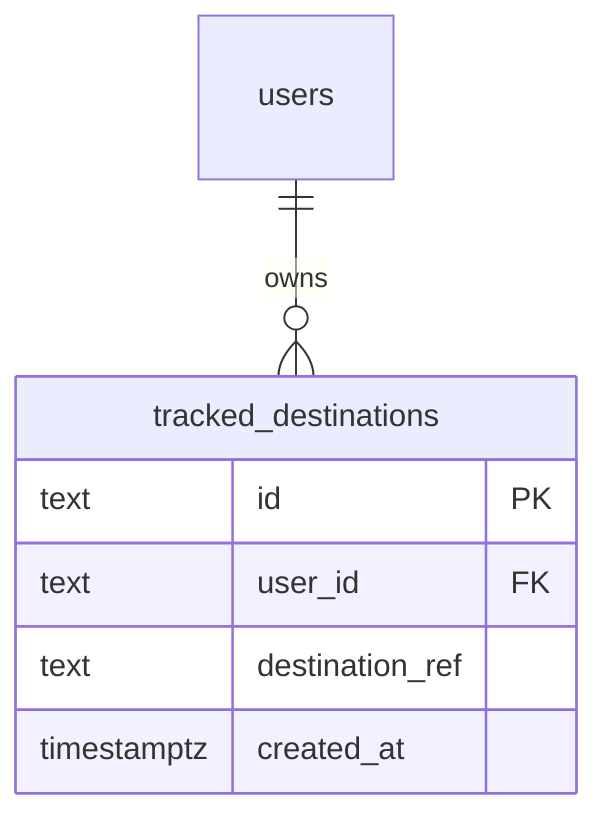

# Data model — dashboard-countries-list

One entity, one aggregate root, no children — `sad.md §5` is explicit that a tracked destination
"holds a destination reference and a creation time and nothing else," with no `domain` layer
because there is no behaviour to put in one this pass. The destination catalogue itself is a
frozen in-code constant (`sad.md §5`, ADR-0006), not a table, so it carries no schema here.

## ER diagram

## Entities

### `tracked_destinations`

| Column | Type | Constraints | Notes |
|---|---|---|---|
| `id` | text | PK, app-generated (UUID v7) | New consumer of the shared `src/lib/id.ts` helper (`sad.md §5`, ADR-0009); matches the repo's existing text-PK convention (`users.id`, `linked_identities.identity_id`) rather than a native UUID column type — neither existing table uses one. |
| `user_id` | text | NOT NULL, FK → `users(id)` | The ownership scope every read and write is filtered by (`sad.md §8` Authorization; ADR-0008) — never applied after the fact. |
| `destination_ref` | text | NOT NULL | The catalogue reference (AC-02, AC-09; ADR-0006). Not a FK: the catalogue is a frozen in-code constant, not a table, so the app layer — not the database — refuses a reference the catalogue doesn't contain. Permanent once written; a delisted reference keeps resolving (AC-09). |
| `created_at` | timestamptz | NOT NULL DEFAULT now() | Matches `users.created_at` / `linked_identities.created_at`. No `updated_at`: the row is never mutated after insert, only deleted (spec §1 hard delete). |

**Aggregate root:** `tracked_destinations` itself — one Traveler, one flat list of records, no child entities this pass (`sad.md §5`).
**Access patterns:**
- List a Traveler's tracked destinations in recorded order, most recent last, tie broken by the record's own id (AC-03; `sad.md §6` "opening the list", §8 Ordering) → index `idx_tracked_destinations_user_created` on `(user_id, created_at, id)`.
- Resolve one tracked destination by id, scoped to its owner (AC-06, AC-08, AC-17; `sad.md §6` "resolving a saved address" / "removing a tracked destination") → served by the PK on `id`; `user_id` is checked in the same query's `WHERE`, not a second lookup, which is what keeps not-yours/removed/never-existed indistinguishable (ADR-0008).

**Constraints:** NOT NULL on `user_id`, `destination_ref`, `created_at`; FK `user_id` → `users(id)`, added via the same idempotent `DO $$ ... EXCEPTION WHEN duplicate_object` pattern `0001_add_linked_identities.sql` already uses. No UNIQUE on `(user_id, destination_ref)` — the same destination may be tracked more than once by design (AC-01: "including when the Traveler already tracks that same destination, which is allowed and creates a separate record"). No `CHECK` constraint on `destination_ref` against the catalogue — the repo uses no `CHECK` constraints today and the refusal is enforced app-side by design (ADR-0006), not database-side.

## Indexes

| Index | Columns | Query it serves |
|---|---|---|
| `idx_tracked_destinations_user_created` | `(user_id, created_at, id)` | The list read in "opening the list" (`sad.md §6`) — every tracked destination owned by the caller, in recorded order, tied broken by id (AC-03). Leading column `user_id` also covers the FK-index self-check for `user_id → users(id)`. |

No index is added for the by-id ownership-scoped lookup (AC-06/AC-08/AC-17): the primary key already indexes `id`, and the query is a single `WHERE id = $1 AND user_id = $2` against that PK — a second index would serve no query the sequences describe.

## Test fixtures

- `newTrackedDestination(overrides?)` — builds a `tracked_destinations` row with a UUID v7 id, a `userId` (from a `newUser()`-style fixture, following the repo's existing pattern for `users`/`linked_identities`), a `destinationRef` defaulted to one of the five catalogue entries, and `createdAt` defaulted to `new Date()`. No real-looking PII — `userId` fixtures use `user-<uuid>@example.test` style emails, matching the existing `users` fixture convention.
