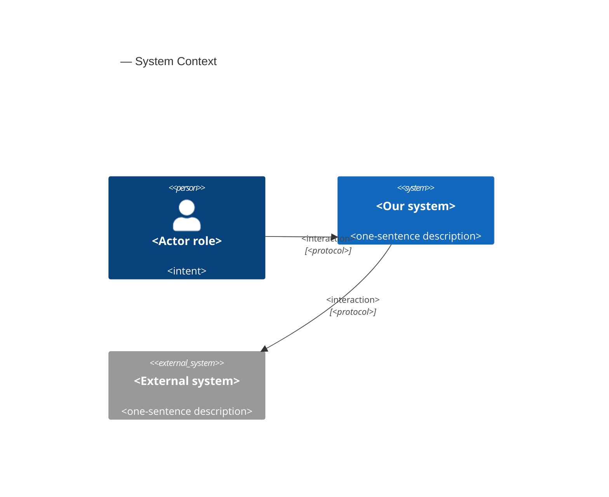
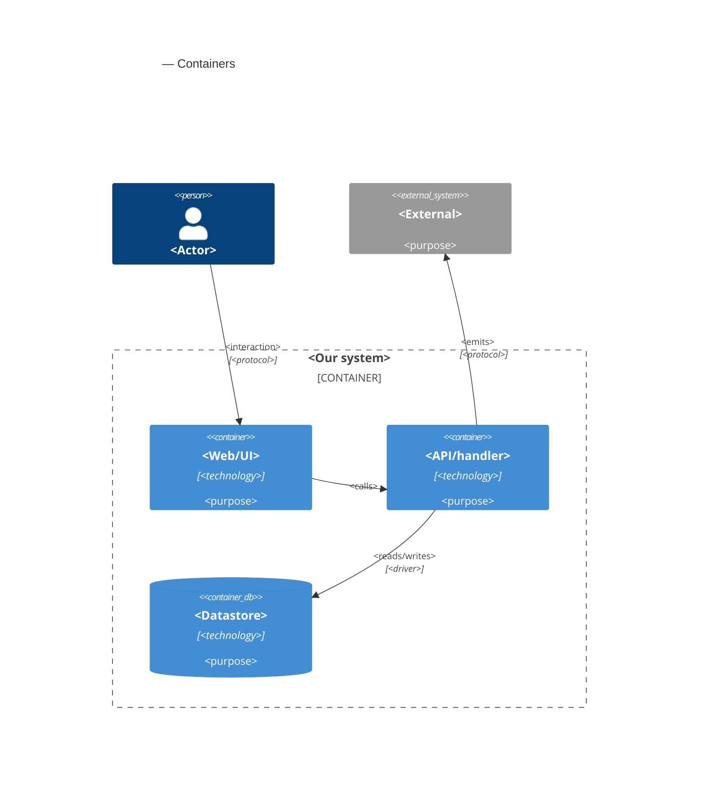

# Software Architecture Document — dashboard-countries-list

<!-- 12 Arc42 sections. Empty section → <!-- N/A: <one-line reason> -->. -->
<!-- C4 Context (L1) lives inline in §3. C4 Container (L2) lives inline in §5. -->
<!-- Numbers in §10 come VERBATIM from spec.md §6 NFR — no inventing, no rounding. -->

## 1. Introduction and goals

**Intent.** Give a Traveler a persistent, curated list of tracked destinations that becomes the app's home and primary navigation. Each record names one entry from the destination catalogue and nothing more; it is a slot that the committed next features extend in place with a visa type, dates and day-counts rather than replace. Today the dashboard body is a placeholder empty state, so nothing in the product can move until a Traveler can say which destinations they care about. This feature creates that object, the five-entry catalogue it draws from, and the screens that manage it — under the app shell that ships before it.

**Top-3 quality goals (1-liners; full scenarios in §10):**

1. **Confidentiality of a Traveler's tracked set** — readable and changeable only by its owner, with a not-yours address indistinguishable from a removed or never-existed one, and nothing of a previous Traveler surviving a confirmed sign-out on a shared device.
2. **Keyboard operability and accessibility of the three overlay surfaces** — the list drawer, the add picker and the removal confirmation each take focus on open, return it to their invoking control on close, and close on Escape, with zero serious or critical violations.
3. **Truthfulness of displayed state** — the screen never shows a state the system has not confirmed: no optimistic row on add, no disappearance before a removal is recorded, no first-run screen when the read merely failed, and no wording that leaves a failed removal ambiguous.

Responsiveness is a real requirement (spec §6: 500 ms to show the list, 800 ms to a confirmed add or removal) but does not lead: §3 excludes production timing this pass, so both numbers are single timed runs in the test suite rather than an operational objective. They are carried as verification leaves under QG-3 in §10.

**Stakeholders.**

| Role | Interest | Sign-off owner? |
|---|---|---|
| Traveler | The only human role in the product (one account = one Traveler; no admin or operator role exists). Creates, reads, opens and removes their own tracked destinations. | No |
| Tech Lead | SAD approval; owner of the §8 open questions on the record primitive, the offline deferral and the set cap | Yes |
| Security Lead | Mandatory security review (spec §6.1): a new owned resource, a new authorization boundary, a new category of personal data, and an identifier exposed in a shareable address | Yes |
| PM | Consulted on §10 quality goals and §11 severities; owns the deferred metrics decision and destination-catalogue ownership (spec §8) | No |

<!-- Decision overrides (¶4) — populated by the critic resolution loop, empty otherwise. -->

## 2. Constraints

**Technical.** Read from the repository at HEAD, not from `docs/architecture-map.md`, which is stale (it reflects commit `53d3d41` and still describes a greenfield baseline with Auth.js).

- TypeScript 5.5 on Node.js ≥ 22 (`package.json` `engines`), pnpm.
- Next.js 14.2 App Router; React 18.3. Pages are Server Components; interactive containers are `"use client"`.
- Clerk 7.8 (`@clerk/nextjs`) is the identity provider — **not** Auth.js. Server-side session via `await auth()` in `src/modules/auth/infra/session-deps.ts:10`; client-side via `useClerk()` / `useUser()`.
- `src/middleware.ts` uses a **narrow allowlist** matcher (`config.matcher`, lines 32–39), deliberately not Clerk's documented catch-all. Any route this feature adds is unauthenticated until listed there, and any client route mounting Clerk hooks must be listed for the Clerk context to initialize.
- PostgreSQL via Drizzle ORM 0.33 + `postgres` 3.4; `drizzle-kit` 0.24 for migrations. Existing schema is two tables only: `users`, `linked_identities` (`src/db/schema.ts`).
- TanStack Query 5.102 for client data. The `QueryClient` is instantiated per render in `src/app/providers.tsx` to avoid cross-Traveler leakage under SSR.
- Tailwind CSS 3.4 with `tailwind.config.ts` present and unextended — default breakpoints (`sm` 640 / `md` 768 / `lg` 1024 / `xl` 1280). No component library, no headless-UI or Radix dependency.
- Vitest 2.0 + Testing Library + jsdom for unit and component tests; Playwright 1.46 for e2e; `@electric-sql/pglite` available for database-backed tests. No accessibility-checking tool is wired today.

**Organisational.**

- Team: one developer. No parallelism to exploit, so §4 prefers the smallest reviewable diff over decomposition that only pays off across people.
- Deadline: none — the product is pre-launch, which is the same reason spec §8 declines to score its priority. Scope, not the calendar, is the binding constraint.
- Effort budget: not fixed. Anything that would materially grow the change becomes a §11 row rather than silent scope growth.
- Sequencing constraint (hard): the **app shell feature ships first** (spec §1, §3). This SAD assumes the shell owns the header, the logout action and the one-time linked-account confirmation, and it places exactly one requirement on the shell — a header slot a page can put a navigation control into, which is where the narrow-screen list toggle lives (AC-12).

**Conventions.** Project convention file: `CLAUDE.md`; design canon: `docs/design-system.md`.

- Feature-first modules under `src/modules/<name>/`, each owning its own `ui` / `app` / `infra`. No shared components/services/hooks grab-bag; shared UI primitives live in `src/modules/ui/`.
- Unified error envelope `{ error: { code, message, details? } }` from every API route, produced by `toErrorEnvelope` / `mapUnknownError` in `src/lib/errors.ts`; `AppError(code, message, status, details?)` is the thrown form. Error codes are namespaced per module (`auth.*` today).
- App-layer functions return a typed `{ status, body }` result and the route serializes it — established by `src/modules/dashboard/app/get-dashboard.ts` and `src/app/api/v1/dashboard/route.ts`.
- Query keys are `[<resource>, userId]` (`src/modules/dashboard/app/dashboard-query.ts:48`), with `staleTime: Infinity`, `gcTime: Infinity`, `retry: false`, and no refetch on focus or reconnect.
- IDs: UUIDv7 generated app-side per `CLAUDE.md` — **no helper exists yet**; this feature is the first to need one.
- Drizzle ORM only, no raw SQL outside `src/db/`; one `drizzle-kit` migration per schema change, forward **and** down (`drizzle/NNNN_*.sql` + `.down.sql`).
- Tests colocated as `*.test.ts(x)` beside source; Playwright e2e under `e2e/`.
- Tailwind utility classes only, no CSS-in-JS.
- Copy is externalized as dot-notation keys in `src/lib/i18n/en.json`, resolved server-side by `translate()` and passed into components as an overridable `strings` prop.

**Regulatory / external.**

- No formal regime (no GDPR/DPA programme, no retention policy) applies to this pre-launch product today. The binding external requirement is the one spec §6.1 sets itself: **a security review is required** before this ships — a new owned resource, a new authorization boundary, a new category of personal data (travel intent), and a resource identifier exposed in a shareable address.
- Removal is a permanent hard delete by decision (spec §1), so no retention or archival obligation is inherited.

## 3. Context and scope

<!-- 🎯 Why: draws the SYSTEM BOUNDARY — who talks to it from outside, where the trust zone ends.
     Without §3, §5 and §8 (authorization) blur — unclear what's «inside» vs «outside».
     📋 Write: 2–3 sentences of business context + an external-systems table + a C4Context block.
     📌 «External: none (deliberate, no third-party in v1)» is itself a decision worth stating.
     Trust boundary — the line past which you don't trust data without checking it.
     Never N/A — greenfield still draws the planned actors + external systems. -->

<Business context in 2–3 sentences. What the system does for whom.>

<!-- brownfield: <one-line scan summary> (or «N/A — greenfield repo» if no source existed) -->

**External systems (in / out):**

| Actor or system | Type | Interaction |
|---|---|---|
| <author role> | Person | <what they do> |
| <external service> | System (internal/external) | <interaction> |
| <identity provider> | System (external) | <provides auth tokens> |

**C4 Context (L1):** <!-- syntax → references/c4-mermaid-syntax.md. Real names, no <placeholder> stubs. -->



## 4. Solution strategy

<!-- 🎯 Why: the 3–4 STRATEGIC PILLARS every ADR grows from. Without §4 each ADR looks random —
     there's no umbrella. ⭐ The densest section — the blast-radius gate fires almost always here
     (decisions are irreversible + multi-module).
     📋 Write: 3–4 choices; each a heading + 2–3 sentences of rationale.
     📌 «Store content as a table of typed blocks» is a pillar — ADR-0001 grows from it. -->

**Top strategic choices (the seeds for ADRs):**

1. **<e.g. Module isolation through events>** — <2–3 sentences citing quality goals + constraints>.
2. **<e.g. Single-store persistence>** — <2–3 sentences>.
3. **<e.g. Server-rendered read side>** — <2–3 sentences>.

Each tactical decision in later sections should trace to one of these seeds. Tactical decisions that *contradict* a strategic choice are red flags — surface them in §11.

## 5. Building block view

<!-- 🎯 Why: INTERNAL DECOMPOSITION — modules, containers, datastores. The static topology: who
     may talk to whom. Without §5, §6 (the flows) has no vocabulary of participants.
     📋 Write: 1 ¶ on the style (layered / hexagonal / clean / event-driven) + a folder tree + a
     C4Container block.
     📌 Draw ONE Container per declared `target_surface` (frontmatter): a fullstack
     [backend-service, web-frontend] = a backend-API container + a web/SPA container; a
     [backend-service, mobile-app] = the API + the mobile app. The Container(web, …) line below is
     just one surface's container — swap/add per what was declared in §4. → _shared/surfaces.md
     📌 e.g. «web app, content API, media worker, datastore, object store, CDN». -->

<One paragraph: layered / hexagonal / clean / event-driven, and why.>

**Internal decomposition:**

```
<e.g. modules/<feature>/>
├── domain/       <entities + sentinel errors>
├── app/          <use cases / services>
├── infra/        <repository + integration impl>
├── ports/        <handlers, DTOs, error mapping>
└── wiring        <self-wiring entry point>
```

**C4 Container (L2):** <!-- syntax → references/c4-mermaid-syntax.md. Real names, no <placeholder> stubs. ONE Container per declared target_surface (frontmatter); the web container below is one example surface. -->



## 6. Runtime view

<!-- 🎯 Why: the RUNTIME FLOW of 1–2 critical scenarios — who talks to whom, when, in what order.
     Without §6, §5 is just boxes with no life.
     📋 Write: a Mermaid sequenceDiagram. Participants are names from §5 (don't invent new ones).
     Messages are semantic («saves a draft»), NO HTTP verbs / paths / status codes — endpoint-level
     sequences arrive at the `api` stage.
     📌 e.g. «author → web: composes draft → web → content API: save». Seed the primary flow(s) here;
     the `sequences` stage then covers every §5 AC (no cap). Never N/A for M+; XS/S keeps ≥1 happy-path flow. -->

**Critical flow 1: <flow name>**

```mermaid
sequenceDiagram
    actor Actor
    participant Web
    participant Service
    participant Store
    Actor->>Web: <action>
    Web->>Service: <call>
    Service->>Store: <write>
    Store-->>Service: ok
    Service-->>Web: result
    Web-->>Actor: confirmation
```

**Critical flow 2: <e.g. async event propagation>** — <if applicable, otherwise N/A>.

## 7. Deployment view

<!-- 🎯 Why: the TOPOLOGY DevOps must know without reading the deploy charts — how many replicas,
     where the background worker lives, AT WHAT NUMBERS we scale.
     📋 Write: 2–3 sentences on topology + monitoring + concrete threshold numbers.
     📌 e.g. «500 authors → partition by quarter» (not «we'll think about scale later»).
     🎯 N/A allowed for XS/S that reuses an existing deployment unit with no change.
     Deployment-diagram scaffold → templates/deployment.md. -->

<Topology in 2–3 sentences. Where it runs, replicas, scaling thresholds.>

**Monitoring:**
- <Metrics — e.g. `<metric_name>`>
- <Alerts — e.g. «worker lag > 10 min → page on-call»>
- <Tracing — e.g. spans on the request boundary>

**Scaling thresholds:**
- <e.g. comfortable in one table up to N rows/year>
- <e.g. partition by quarter above N rows/year>

<!-- For XS/S with no deployment change: <!-- N/A: reuses existing deployment unit, no infra change --> -->

## 8. Crosscutting concepts

<!-- 🎯 Why: CROSS-CUTTING PATTERNS spanning several modules: logging, errors, authorization, ID
     strategy, events, caching. ⭐ The second-densest section. A pattern inside one module is NOT
     here; a project-wide convention belongs in the convention file.
     📋 Write: a table — concept / convention / where defined. One row per concept.
     📌 e.g. «sortable time-based IDs generated in the app layer» as a default from the convention file. -->

| Concept | Convention | Where defined |
|---|---|---|
| Logging | <e.g. structured, fields `module=<name>`> | <convention file §X or here> |
| Authentication | <e.g. token-based via middleware> | <convention file §X> |
| Error handling | <e.g. domain sentinel → ports error mapping → JSON> | <convention file §X> |
| ID strategy | <e.g. sortable time-based ID in the app layer> | <convention file §X> |
| Internationalisation | <e.g. N/A, single language> | — |
| Observability | <e.g. tracing on the request boundary> | — |
| Events | <module-specific patterns, if any> | <here> |

## 9. Architecture decisions

<!-- 🎯 Why: the REVERSE INDEX onto the adr/ folder. `ls adr/` gives the files; §9 gives the
     semantics — why they exist, which SAD section they attach to, what status.
     📋 Write: a 4-column table, one row per ADR. Mixed status is fine.
     📌 e.g. «0001 | Store content as a table of typed blocks | Accepted | §4». -->

| # | Title | Status | Section |
|---|---|---|---|
| <NNNN> | <imperative — e.g. "Use a sliding-window counter for rate limiting"> | Accepted | §<N> |
| <NNNN> | <imperative — e.g. "Co-locate the worker in the API process"> | Accepted | §<N> |

ADR files live under `docs/features/<slug>/adr/NNNN-<title>.md`.

## 10. Quality requirements

<!-- 🎯 Why: the QUALITY TREE — take a goal from §1 and break it into concrete leaves: tests,
     metrics, configs, drills. ⭐ Without §10, §1 is a manifesto. With §10 each declaration maps
     to something PROVABLE.
     📋 Write: per §1 goal — When / Then / How-verify. Numbers from spec §6 NFR VERBATIM (don't
     round ≤250ms to ≤300ms — that's a critic F6 hit).
     📌 e.g. «p95 ≤ 500 ms on a block update, verified by a 100 req/s load test». -->

Each top-3 goal from §1 expanded into a full scenario:

**QG-1. <quality attribute>**
- **When:** <trigger condition>
- **Then:** <expected behaviour with numbers from spec §6 NFR>
- **How verify:** <test / chaos drill / load test / metric>

**QG-2. <quality attribute>**
- **When:** <trigger>
- **Then:** <expected>
- **How verify:** <how>

**QG-3. <quality attribute>**
- **When:** <trigger>
- **Then:** <expected>
- **How verify:** <how>

## 11. Risks and technical debt

<!-- 🎯 Why: ⭐ collects EVERYTHING that can break — not only the technical. Without §11 risks get
     discussed at standups and lost; debt lives only in the head of whoever accepted it.
     📋 Write: a risk/debt table — severity — mitigation — owner. Accepted debt in its own block.
     📌 The first risk is often a product risk, not a technical one. That's normal. -->

<!-- Severity literals: Low / Medium / High for regular risks; "Open question" for rows created by
     a Save-as-OQ resolution during the Socratic walk (see references/socratic.md). -->

| Risk / debt | Severity | Mitigation | Owner |
|---|---|---|---|
| <e.g. Worker lag may reach hours during a downstream outage> | Medium | <alert >10 min, on-call playbook, retry backoff> | <DevOps> |
| <e.g. No event-schema versioning in v1> | Medium | <ADR-NNNN planned for v2, tolerate unknown fields> | <Backend> |
| Open architectural decision: <decision-headline> | Open question | Resolve before <stage trigger or YYYY-MM-DD>; <inline rationale from the Save-as-OQ> | <owner> |

**Accepted debt (acceptable in v1, plan to fix later):**
- <e.g. the entity is immutable / unversioned — OK for v1, may need audit versioning in v2>

## 12. Glossary

<!-- 🎯 Why: ⭐ the DOMAIN GLOSSARY that ends arguments a year later («checkpoint — weekly or
     biweekly? quarter — calendar or fiscal?»).
     📋 Write: a term / meaning table. Business + technical terms mixed.
     📌 e.g. «Lesson | a unit inside a course made of blocks (text, video)». -->

| Term | Meaning |
|---|---|
| <e.g. domain object A> | <its meaning in this domain> |
| <e.g. domain object B> | <its meaning> |
| <e.g. domain invariant name> | <the rule, in plain language> |
