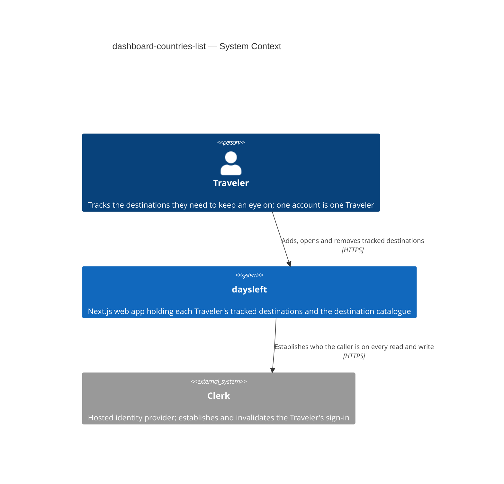
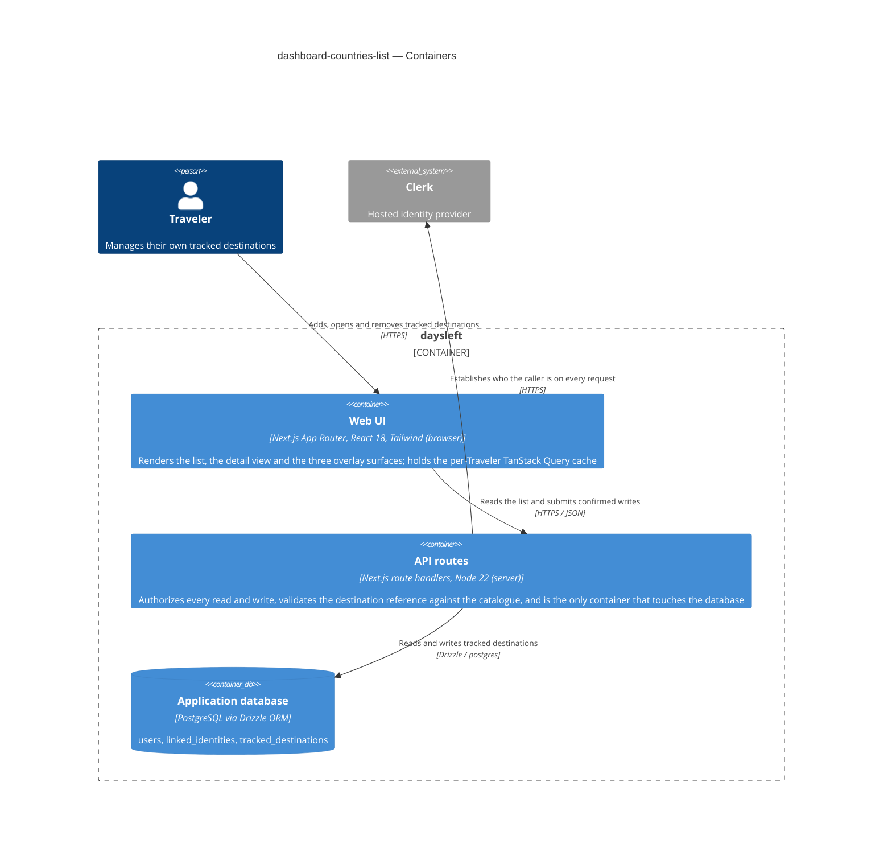
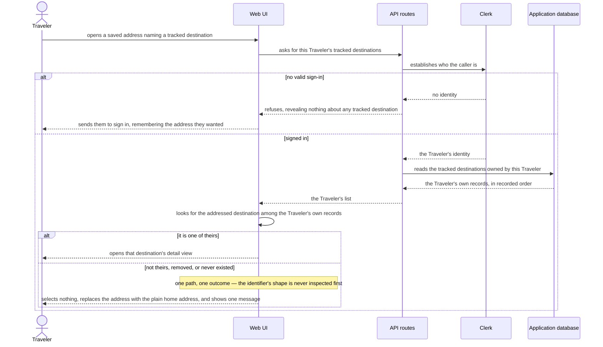

# Software Architecture Document — dashboard-countries-list

<!-- 12 Arc42 sections. Empty section → <!-- N/A: <one-line reason> -->. -->
<!-- C4 Context (L1) lives inline in §3. C4 Container (L2) lives inline in §5. -->
<!-- Numbers in §10 come VERBATIM from spec.md §6 NFR — no inventing, no rounding. -->

## 1. Introduction and goals

**Intent.** Give a Traveler a persistent, curated list of tracked destinations that becomes the app's home and primary navigation. Each record names one entry from the destination catalogue and nothing more; it is a slot that the committed next features extend in place with a visa type, dates and day-counts rather than replace. Today the dashboard body is a placeholder empty state, so nothing in the product can move until a Traveler can say which destinations they care about. This feature creates that object, the five-entry catalogue it draws from, and the screens that manage it — under the app shell that ships before it.

**Top-3 quality goals (1-liners; full scenarios in §10):**

1. **Confidentiality of a Traveler's tracked set** — readable and changeable only by its owner, with a not-yours address indistinguishable from a removed or never-existed one, and nothing of a previous Traveler surviving a confirmed sign-out on a shared device.
2. **Keyboard operability and accessibility of the three overlay surfaces** — the list drawer, the add picker and the removal confirmation each take focus on open, return it to their invoking control on close, and close on Escape, with zero serious or critical violations.
3. **Truthfulness of displayed state** — the screen never shows a state the system has not confirmed: no optimistic row on add, no disappearance before a removal is recorded, no first-run screen when the read merely failed, and no wording that leaves a failed removal ambiguous.

Responsiveness is a real requirement (spec §6: 500 ms to show the list, 800 ms to a confirmed add or removal) but does not lead: §3 excludes production timing this pass, so both numbers are single timed runs in the test suite rather than an operational objective. They are carried as verification leaves under QG-3 in §10.

**Stakeholders.**

| Role | Interest | Sign-off owner? |
|---|---|---|
| Traveler | The only human role in the product (one account = one Traveler; no admin or operator role exists). Creates, reads, opens and removes their own tracked destinations. | No |
| Tech Lead | SAD approval; owner of the §8 open questions on the record primitive, the offline deferral and the set cap | Yes |
| Security Lead | Mandatory security review (spec §6.1): a new owned resource, a new authorization boundary, a new category of personal data, and an identifier exposed in a shareable address | Yes |
| PM | Consulted on §10 quality goals and §11 severities; owns the deferred metrics decision and destination-catalogue ownership (spec §8) | No |

<!-- Decision overrides (¶4) — populated by the critic resolution loop, empty otherwise. -->

## 2. Constraints

**Technical.** Read from the repository at HEAD, not from `docs/architecture-map.md`, which is stale (it reflects commit `53d3d41` and still describes a greenfield baseline with Auth.js).

- TypeScript 5.5 on Node.js ≥ 22 (`package.json` `engines`), pnpm.
- Next.js 14.2 App Router; React 18.3. Pages are Server Components; interactive containers are `"use client"`.
- Clerk 7.8 (`@clerk/nextjs`) is the identity provider — **not** Auth.js. Server-side session via `await auth()` in `src/modules/auth/infra/session-deps.ts:10`; client-side via `useClerk()` / `useUser()`.
- `src/middleware.ts` uses a **narrow allowlist** matcher (`config.matcher`, lines 32–39), deliberately not Clerk's documented catch-all. Any route this feature adds is unauthenticated until listed there, and any client route mounting Clerk hooks must be listed for the Clerk context to initialize.
- PostgreSQL via Drizzle ORM 0.33 + `postgres` 3.4; `drizzle-kit` 0.24 for migrations. Existing schema is two tables only: `users`, `linked_identities` (`src/db/schema.ts`).
- TanStack Query 5.102 for client data. The `QueryClient` is instantiated per render in `src/app/providers.tsx` to avoid cross-Traveler leakage under SSR.
- Tailwind CSS 3.4 with `tailwind.config.ts` present and unextended — default breakpoints (`sm` 640 / `md` 768 / `lg` 1024 / `xl` 1280). No component library, no headless-UI or Radix dependency.
- Vitest 2.0 + Testing Library + jsdom for unit and component tests; Playwright 1.46 for e2e; `@electric-sql/pglite` available for database-backed tests. No accessibility-checking tool is wired today.

**Organisational.**

- Team: one developer. No parallelism to exploit, so §4 prefers the smallest reviewable diff over decomposition that only pays off across people.
- Deadline: none — the product is pre-launch, which is the same reason spec §8 declines to score its priority. Scope, not the calendar, is the binding constraint.
- Effort budget: not fixed. Anything that would materially grow the change becomes a §11 row rather than silent scope growth.
- Sequencing constraint (hard): the **app shell feature ships first** (spec §1, §3). This SAD assumes the shell owns the header, the logout action and the one-time linked-account confirmation, and it places exactly one requirement on the shell — a header slot a page can put a navigation control into, which is where the narrow-screen list toggle lives (AC-12).

**Conventions.** Project convention file: `CLAUDE.md`; design canon: `docs/design-system.md`.

- Feature-first modules under `src/modules/<name>/`, each owning its own `ui` / `app` / `infra`. No shared components/services/hooks grab-bag; shared UI primitives live in `src/modules/ui/`.
- Unified error envelope `{ error: { code, message, details? } }` from every API route, produced by `toErrorEnvelope` / `mapUnknownError` in `src/lib/errors.ts`; `AppError(code, message, status, details?)` is the thrown form. Error codes are namespaced per module (`auth.*` today).
- App-layer functions return a typed `{ status, body }` result and the route serializes it — established by `src/modules/dashboard/app/get-dashboard.ts` and `src/app/api/v1/dashboard/route.ts`.
- Query keys are `[<resource>, userId]` (`src/modules/dashboard/app/dashboard-query.ts:48`), with `staleTime: Infinity`, `gcTime: Infinity`, `retry: false`, and no refetch on focus or reconnect.
- IDs: UUIDv7 generated app-side per `CLAUDE.md` — **no helper exists yet**; this feature is the first to need one.
- Drizzle ORM only, no raw SQL outside `src/db/`; one `drizzle-kit` migration per schema change, forward **and** down (`drizzle/NNNN_*.sql` + `.down.sql`).
- Tests colocated as `*.test.ts(x)` beside source; Playwright e2e under `e2e/`.
- Tailwind utility classes only, no CSS-in-JS.
- Copy is externalized as dot-notation keys in `src/lib/i18n/en.json`, resolved server-side by `translate()` and passed into components as an overridable `strings` prop.

**Regulatory / external.**

- No formal regime (no GDPR/DPA programme, no retention policy) applies to this pre-launch product today. The binding external requirement is the one spec §6.1 sets itself: **a security review is required** before this ships — a new owned resource, a new authorization boundary, a new category of personal data (travel intent), and a resource identifier exposed in a shareable address.
- Removal is a permanent hard delete by decision (spec §1), so no retention or archival obligation is inherited.

## 3. Context and scope

A Traveler signs in and manages a personal, curated list of tracked destinations — adding one from the five destinations the app supports, opening it at its own address, and removing it permanently behind a confirmation. The list is the app's home and its primary navigation. The system holds one new category of personal data (which destinations a Traveler tracks, and when each was added) and exposes no way for one Traveler to read or change another's.

<!-- brownfield: scanned at HEAD e1a1ecc. Real modules: auth (app/infra/ui, Clerk-backed), dashboard (app/ui, header + "Nothing tracked yet." placeholder), ui (8 primitives), sync (Dexie initialized, zero stores). Schema is users + linked_identities only. No dynamic route segment, no overlay/focus-trap primitive, no UUIDv7 helper, no accessibility tooling. docs/architecture-map.md is stale — it predates the auth and query features and names Auth.js. -->

**External systems (in / out):**

| Actor or system | Type | Interaction |
|---|---|---|
| Traveler | Person | Adds, views, opens and removes their own tracked destinations over HTTPS. The only human role — one account is one Traveler; no admin, operator or organisation concept exists. |
| Clerk | System (external) | Hosted identity provider, already integrated by the shipped auth feature. Answers who the caller is on every read and write of a tracked destination, and is the authority that declares a sign-in invalid (AC-14) or ended (AC-15). |
| PostgreSQL | System (internal) | The system's own store, not another party. Drawn as a container in §5 rather than an external system here; hosting is deliberately unspecified. |

Nothing else crosses the boundary. There is no analytics or telemetry egress (spec §3), no third-party source for the destination catalogue — it is five entries defined in code (spec §3 excludes Traveler-defined destinations; who owns it and what would move it out of the codebase is spec §8, owned by PM) — and no email or notification path. The **app shell** is inside the system but outside this feature: it ships first, owns the header, logout and the linked-account confirmation, and this feature consumes exactly one thing from it, a header slot for the narrow-screen list control.

**Trust boundary.** Clerk's answer to "who is calling" is the line. Everything on the far side is untrusted, including two inputs that look trustworthy but are not: the destination reference submitted on an add (the picker offers only five, but the criterion in AC-02 is a guarantee the system upholds for *any* request, however it arrives) and the tracked-destination identifier arriving in a URL (AC-06 — it may name another Traveler's record, a removed one, or nothing at all, and all three must be indistinguishable).

**C4 Context (L1):**



## 4. Solution strategy

**Top strategic choices (the seeds for ADRs):**

1. **Serve the list over an HTTP API consumed by TanStack Query** — the browser reaches tracked destinations through `/api/v1/destinations` endpoints, read and mutated through query and mutation hooks, rather than through Server Components and server actions. This is the surface decision: it declares `target_surfaces: [backend-service, web-frontend]`, because an HTTP endpoint is a container distinct from the web app while a server action is not. It reproduces exactly what both shipped features already do (`src/app/api/v1/dashboard/route.ts` + `src/modules/dashboard/app/dashboard-query.ts`), gives the `api` stage a real contract to lock, and leaves the deferred offline-sync feature (spec §8) a server interface to reuse. It also makes AC-11's single recoverable error and AC-14's session-invalid precedence expressible in the one place that already expresses them — the query layer's error path. → **ADR-0001**.

2. **Name an open tracked destination in a dynamic path segment under the existing home** — `/dashboard/[trackedDestinationId]`, with `/dashboard` as the plain home address AC-06 and AC-07 fall back to. "Saved address" is a glossary term, so this is a shipped guarantee rather than an internal detail: it is what AC-05's reload, AC-06's replacement and AC-13's return-after-sign-in all operate on. The existing narrow-allowlist middleware matcher already covers `/dashboard/:path*` and the shipped `return_to` mechanism already round-trips such a path, so the choice costs no change in the app shell's territory. → **ADR-0002**.

3. **Give the feature its own `destinations` module beside `dashboard`** — `src/modules/destinations/` owns the destination catalogue, the tracked-destination app logic, the query layer and every screen; `src/modules/dashboard/` keeps only what the shell feature leaves it and renders the destinations module in its body. The domain primitives are "tracked destination" and "destination catalogue" (glossary), not "dashboard", and trips and rules will import them by that name. Retiring the dashboard module outright was rejected on sequencing: §2 fixes the shell as shipping first, and two features rewriting one folder in sequence is how a shipped guarantee gets dropped. → **ADR-0003**.

4. **Build one in-repo `Modal` primitive and give all three overlay surfaces the same focus contract through it** — the list drawer, the add picker and the removal confirmation are one behaviour used three times (focus in on open, focus back to the invoking control on close, Escape closes), so the contract lives in a single `src/modules/ui/Modal` rather than being re-implemented per surface. It is hand-rolled with no dependency, matching the eight existing zero-dependency primitives and the `code`-tool design canon. Native `<dialog>` was excluded on evidence, not taste: jsdom 30 in this repo does not implement `showModal`, so §6's required focus assertions would exercise a polyfill instead of shipped behaviour. The correctness risk this carries is accepted and tracked in §11. → **ADR-0004**.

5. **Confirm every write on the server, then splice the confirmed record into the cache** — no optimistic display anywhere (spec §1): a create responds with the tracked destination it recorded and a removal confirms the record it removed, and only then does `onSuccess` update the cached list through `setQueryData`. One round trip keeps §6's 800 ms budget — which is clocked to the *confirmed* state — achievable, while the list still never shows something the system has not recorded. The cost is that the client splice must reproduce the server's ordering rule, so ordering is specified once in §8 and implemented in two places. → **ADR-0005**.

**Bundled convention defaults** (taken from the repository, not decided here): error codes namespaced `destinations.*` under the existing envelope; query key `["destinations", userId]`; `staleTime`/`gcTime` `Infinity` with `retry: false` and no refetch on focus or reconnect — which is already exactly what AC-11 demands, a retry only when the Traveler asks and nothing retrying on its own; copy externalized as `destinations.*` keys in `src/lib/i18n/en.json` and passed as an overridable `strings` prop; the five-entry catalogue defined inside the `destinations` module, since nothing else reads it.

Each tactical decision in later sections traces to one of these seeds. Tactical decisions that *contradict* a strategic choice are red flags — surfaced in §11.

## 5. Building block view

The module is **layered feature-first**, matching the shape `src/modules/auth/` already established: `ui` holds React components and containers, `app` holds use-case functions that take an injected dependency object and return a typed `{ status, body }` result, and `infra` holds the Drizzle repository plus the dependency builder that wires it. There is no `domain` layer because there is no behaviour to put in one this pass — a tracked destination holds a destination reference and a creation time and nothing else. Domain logic arrives with visa types, dates and the rules engine, and the layer arrives with it.

The **destination catalogue is a frozen constant**, not a table and not a container: five entries, each a permanent reference plus a display name, compiled into both the API routes (which validate against it) and the web UI (which populates the picker from it). A `tracked_destinations` row stores its catalogue reference as a text column, and the app layer refuses any reference the catalogue does not contain before writing anything. This is what makes AC-09 fall out for free — delisting a destination means removing it from the addable set while every stored reference keeps resolving, so a delisted destination stays fully openable and removable. AC-02's refusal is therefore enforced in code rather than by the database, and it carries its own test (§10) rather than being structurally impossible. → **ADR-0006**.

**Internal decomposition:**

```
src/modules/destinations/
├── app/
│   ├── catalogue.ts                  frozen five-entry catalogue + reference lookup
│   ├── list-tracked-destinations.ts  use case: read the signed-in Traveler's list
│   ├── add-tracked-destination.ts    use case: validate the reference, record, return the record
│   ├── remove-tracked-destination.ts use case: authorize ownership, hard-delete, confirm
│   └── destinations-query.ts         query key, query options, mutations, typed session-invalid error
├── infra/
│   ├── tracked-destinations-repository.ts  Drizzle access, mirroring UsersRepository
│   └── destinations-deps.ts               buildDestinationsDeps(db), mirroring buildSessionDeps
└── ui/
    ├── DestinationsContainer.tsx     client container: query + mutations, error and session routing
    ├── DestinationList.tsx           the list itself, at both widths
    ├── DestinationListDrawer.tsx     the narrow-screen overlay wrapping DestinationList
    ├── DestinationPicker.tsx         the add picker overlay
    ├── RemoveConfirmation.tsx        the removal confirmation overlay
    ├── DestinationDetail.tsx         one tracked destination; name + nothing-recorded-yet
    └── FirstRunScreen.tsx            no list beside it; single add action

src/modules/ui/
└── Modal/                            new shared primitive: focus in, focus restore, Escape (ADR-0004)

src/app/
├── dashboard/page.tsx                composed by the dashboard module; renders DestinationsContainer
├── dashboard/[trackedDestinationId]/page.tsx   the detail address (ADR-0002)
└── api/v1/destinations/
    ├── route.ts                      GET list, POST create
    └── [trackedDestinationId]/route.ts   DELETE

src/db/schema.ts                      + tracked_destinations
drizzle/                              + one forward migration and its down
src/lib/id.ts                         new: UUIDv7 generation (first consumer, per CLAUDE.md)
```

**C4 Container (L2):**



The web UI never reaches the database and never decides authorization for itself — it reads its own Clerk session only to render, and the answer that matters always comes back through the API. The Dexie local cache (`src/modules/sync/local/db.ts`, currently zero stores) is deliberately absent: spec §3 excludes every offline use of tracked destinations in both directions this pass.

## 6. Runtime view

Two flows are seeded here because they fix the runtime shapes every other flow reuses: write-then-confirm-then-splice, and single-path rejection with no early exit on the shape of an identifier. Participants are the §5 containers. Messages are semantic — endpoint-level detail arrives at the `api` stage, and the remaining flows at the `sequences` stage.

**Critical flow 1: adding a tracked destination (AC-01, AC-02)**

```mermaid
sequenceDiagram
    actor Traveler
    participant Web as Web UI
    participant Api as API routes
    participant Clerk
    participant Db as Application database

    Traveler->>Web: opens the add picker and chooses a destination
    Note over Web: nothing is added to the list yet — no optimistic row
    Web->>Api: asks to record a tracked destination for this catalogue reference
    Api->>Clerk: establishes who the caller is
    Clerk-->>Api: the Traveler's identity
    Api->>Api: checks the reference against the frozen catalogue
    alt reference is not in the catalogue
        Api-->>Web: refuses; nothing was recorded
        Web-->>Traveler: reports that only supported destinations can be tracked
    else reference is supported
        Api->>Db: records a new tracked destination owned by this Traveler
        Db-->>Api: the recorded destination
        Api-->>Web: confirms, returning the recorded destination
        Web->>Web: splices the confirmed record into the cached list
        Web-->>Traveler: shows it in the list and opens its detail view, moving focus there
    end
```

The Traveler may already track the same destination; that is allowed and creates a separate record, so nothing in this flow consults the existing list before recording. The list changes only on the confirming branch — the §6 budget of 800 ms is measured across this whole exchange, which is why it is one round trip (ADR-0005). A failure of the recording step leaves the cache untouched and surfaces the recoverable error of AC-11.

**Critical flow 2: resolving a saved address (AC-05, AC-06, AC-13)**



The three rejection cases share a single branch by design: the system asks only whether the addressed destination is among the ones this Traveler owns, and never asks whether it exists at all. Because the answer is derived from the Traveler's own list rather than from a lookup by identifier, there is no query whose absence of a row could be timed or distinguished, and no malformed-identifier check that could reject early with a different shape of failure.

**The opening read** forks four ways — a confirmed read with records, a confirmed read with none (the only route to the first-run screen), a confirmed invalid sign-in, and every other failure. A confirmed invalid sign-in takes precedence over the recoverable error, and nothing retries on its own before that error is shown. It is drawn in full at the `sequences` stage; its precedence rule is fixed here and in §8.

## 7. Deployment view

This feature introduces **no new deployment unit**. It ships inside the existing single Next.js application — the web UI and the API routes of §5 are two C4 containers but one deployable — and adds one table to the PostgreSQL instance the app already uses. No hosting target has been chosen for either the app or the database; `docs/architecture-map.md` deliberately leaves it out on the grounds that it does not change the architecture, and that remains true here.

The one topological requirement is **ordering**: the `tracked_destinations` migration must be applied before the code that reads it is serving traffic. The repository has `pnpm db:up` and `pnpm db:down` (`scripts/migrate-up.ts` / `migrate-down.ts`) but no deployment pipeline that invokes them, so today this is a manual step and stays one. Because a missing table surfaces as a read failure, the failure mode of getting the order wrong is AC-11's recoverable error rather than data loss — an acceptable outcome for a pre-launch product with one developer, and the reason this is not raised further.

The existing CI workflow (`.github/workflows/ci.yml`) runs `pnpm build`, `pnpm test`, `pnpm lint` and `pnpm test:e2e` on every push to `main` and every pull request, against Node 22 and pnpm 11. That is the only gate this feature passes through, and it is where §10's verification actually runs.

**Monitoring:**

- None is added, and none exists. Spec §3 excludes analytics, telemetry, event tracking and production timing measurement, with the reason that choosing a measurement path for a product holding travel data is its own decision rather than a rider on a UI feature. Spec §8 carries that decision with PM as owner, due before public launch.
- The consequence is stated plainly so it is not discovered later: **every §6 target is verified in the test suite and nowhere else**. Nothing in production will report that the list took longer than 500 ms, that a write exceeded 800 ms, or that reads are failing. The first signal of a problem is a Traveler noticing.

**Scaling thresholds:**

- One Traveler's list must stay operable at **500 tracked destinations** (spec §6). Below that ceiling the read returns the whole list unpaginated, which is what ADR-0005's cache splice assumes.
- Above it, the design would need pagination or virtualization, and ADR-0005's splice would have to become an invalidation. Nothing this pass builds toward that; whether to cap the set at all is a spec §8 open question owned by Tech Lead, due before `/sdd:data-model`.
- The table's growth is bounded by Travelers × their own list sizes, with no shared contention path and no new load profile (spec §6 marks throughput N/A for exactly this reason). A single unpartitioned table is comfortable well past any pre-launch volume.

## 8. Crosscutting concepts

| Concept | Convention | Where defined |
|---|---|---|
| Authentication | Clerk. Server side: `await auth()` behind an injected `getAuthUserId` dependency, mirroring `buildSessionDeps`. Client side: `useUser()` / `useClerk()` for rendering only — never for an authorization decision. | `src/modules/destinations/infra/destinations-deps.ts`; precedent `src/modules/auth/infra/session-deps.ts:10` |
| Authorization | Ownership is the only rule: every read and every write is scoped to the caller's own Traveler id in the query itself, never filtered after the fact. There is no role, no sharing and no second principal. | §5 app layer; ADR-0008 |
| Route protection | Every new page and API route is added to the narrow allowlist in `src/middleware.ts`. `/dashboard/:path*` already covers the detail page; `/api/v1/destinations` and `/api/v1/destinations/:path*` must be added explicitly. | `src/middleware.ts` `config.matcher` |
| Error handling | Unified envelope `{ error: { code, message } }` via `toErrorEnvelope` / `mapUnknownError`; app-layer functions return typed `{ status, body }` and the route serializes. Codes namespaced `destinations.*`: `destinations.unsupported_reference` (AC-02), `destinations.not_found` (AC-06 / removal). | `src/lib/errors.ts`; §5 app layer |
| Not-found as authorization | A tracked destination that is not the caller's, one that was removed, and one that never existed are one case with one code, one message and one code path. No branch inspects the shape of an identifier before the ownership-scoped lookup, so there is no early rejection to distinguish. | ADR-0008 |
| Error precedence | A confirmed invalid sign-in always wins: the client routes to sign-in and stops showing tracked destinations rather than rendering the recoverable error. Every other failure — offline, timeout, unreadable answer, server fault — collapses into one presentation with a Traveler-driven retry. Nothing retries on its own (`retry: false`), and nothing polls in the background for invalidation. | ADR-0001; spec AC-11, AC-14 |
| Session discard | On a confirmed sign-out the whole query cache is dropped with `queryClient.clear()`, not a list of named keys, so no future resource can leak by forgetting to register. | ADR-0007 |
| ID strategy | UUIDv7, generated app-side by a new shared `src/lib/id.ts` — this feature is the repository's first consumer of the convention `CLAUDE.md` already mandates. | ADR-0009; `CLAUDE.md` |
| Ordering | One rule, stated once and implemented twice (server read query, client cache splice): recorded order, most recent last, with the record's own identifier settling ties. UUIDv7's time-sortability makes the tie-break agree with recorded order rather than being arbitrary. | ADR-0005, ADR-0009; spec AC-03 |
| Overlay focus contract | One `src/modules/ui/Modal` primitive owns it for all three surfaces: focus moves in on open, returns to the invoking control on close, Escape closes. Surfaces never implement it themselves. | ADR-0004; spec AC-12 |
| Catalogue validation | Every write validates its destination reference against the frozen in-code catalogue before recording anything, at the app-layer boundary rather than in the UI — the refusal is a guarantee for any request, whatever path it arrives by. | ADR-0006; spec AC-02 |
| Persistence | Drizzle ORM only, no raw SQL outside `src/db/`; access through a `TrackedDestinationsRepository` injected as a dependency, mirroring `UsersRepository`. One `drizzle-kit` migration, forward and down. | `CLAUDE.md`; precedent `src/modules/auth/infra/users-repository.ts` |
| Client data | TanStack Query. Key `["destinations", userId]`; `staleTime` and `gcTime` `Infinity`, `retry: false`, no refetch on focus or reconnect — which is exactly AC-11's requirement that retries happen only when the Traveler asks. Writes are mutations whose confirmed record is spliced into the cache. | ADR-0001, ADR-0005; precedent `src/modules/dashboard/app/dashboard-query.ts:48` |
| Internationalisation | Copy externalized as `destinations.*` dot-notation keys in `src/lib/i18n/en.json`, resolved server-side by `translate()` and passed into components as an overridable `strings` prop. Single language; no i18n framework. | `src/lib/i18n/`; precedent `src/app/dashboard/strings.ts` |
| Logging | Nothing structured exists in the repository and none is added. A server fault reaches the Traveler as AC-11's recoverable error and reaches the developer only through the platform's own output. | — |
| Observability | N/A this pass — spec §3 excludes analytics, telemetry and production timing; §7 states the consequence that every §6 target is verified in tests and nowhere else. | spec §3, §8 (PM-owned) |
| Events | N/A — no asynchronous flow, no queue, no background worker. Every operation is a synchronous request the Traveler is waiting on. | — |
| Offline | N/A this pass, deliberately and against the project's stated offline-first baseline: reads and writes both require the network, and their absence surfaces as AC-11's recoverable error. The Dexie store stays empty. | spec §3, §8 (Tech Lead-owned) |

## 9. Architecture decisions

| # | Title | Status | Section |
|---|---|---|---|
| 0001 | Serve tracked destinations over an HTTP API consumed by TanStack Query | Accepted | §4 |
| 0002 | Address an open tracked destination as a path segment under /dashboard | Accepted | §4 |
| 0003 | Give the feature its own destinations module beside dashboard | Accepted | §4 |
| 0004 | Build one in-repo Modal primitive for all three overlay surfaces | Accepted | §4 |
| 0005 | Confirm writes server-side, then splice the confirmed record into the cache | Accepted | §4 |
| 0006 | Store the catalogue reference as a validated text column | Accepted | §5 |
| 0007 | Clear the whole query cache on a confirmed sign-out | Accepted | §8 |
| 0008 | Answer not-yours, removed and never-existed identically | Accepted | §8 |
| 0009 | Generate UUIDv7 identifiers app-side in a shared helper | Accepted | §8 |

ADR files live under `docs/features/dashboard-countries-list/adr/NNNN-<title>.md`.

Decisions taken during the walk that did **not** cross the blast-radius gate, recorded inline instead: the `destinations.*` error-code namespace and the `["destinations", userId]` query key (both mechanical extensions of shipped conventions, §8); the layering of the new module as `ui` / `app` / `infra` with an injected repository (established by `src/modules/auth/`, §5); the catalogue living inside the `destinations` module rather than in a module of its own (§4); and where the accessibility check runs (§10 QG-2) — one criterion only, contained to test tooling.

## 10. Quality requirements

<!-- 🎯 Why: the QUALITY TREE — take a goal from §1 and break it into concrete leaves: tests,
     metrics, configs, drills. ⭐ Without §10, §1 is a manifesto. With §10 each declaration maps
     to something PROVABLE.
     📋 Write: per §1 goal — When / Then / How-verify. Numbers from spec §6 NFR VERBATIM (don't
     round ≤250ms to ≤300ms — that's a critic F6 hit).
     📌 e.g. «p95 ≤ 500 ms on a block update, verified by a 100 req/s load test». -->

Each top-3 goal from §1 expanded into a full scenario:

**QG-1. <quality attribute>**
- **When:** <trigger condition>
- **Then:** <expected behaviour with numbers from spec §6 NFR>
- **How verify:** <test / chaos drill / load test / metric>

**QG-2. <quality attribute>**
- **When:** <trigger>
- **Then:** <expected>
- **How verify:** <how>

**QG-3. <quality attribute>**
- **When:** <trigger>
- **Then:** <expected>
- **How verify:** <how>

## 11. Risks and technical debt

<!-- 🎯 Why: ⭐ collects EVERYTHING that can break — not only the technical. Without §11 risks get
     discussed at standups and lost; debt lives only in the head of whoever accepted it.
     📋 Write: a risk/debt table — severity — mitigation — owner. Accepted debt in its own block.
     📌 The first risk is often a product risk, not a technical one. That's normal. -->

<!-- Severity literals: Low / Medium / High for regular risks; "Open question" for rows created by
     a Save-as-OQ resolution during the Socratic walk (see references/socratic.md). -->

| Risk / debt | Severity | Mitigation | Owner |
|---|---|---|---|
| <e.g. Worker lag may reach hours during a downstream outage> | Medium | <alert >10 min, on-call playbook, retry backoff> | <DevOps> |
| <e.g. No event-schema versioning in v1> | Medium | <ADR-NNNN planned for v2, tolerate unknown fields> | <Backend> |
| Open architectural decision: <decision-headline> | Open question | Resolve before <stage trigger or YYYY-MM-DD>; <inline rationale from the Save-as-OQ> | <owner> |

**Accepted debt (acceptable in v1, plan to fix later):**
- <e.g. the entity is immutable / unversioned — OK for v1, may need audit versioning in v2>

## 12. Glossary

<!-- 🎯 Why: ⭐ the DOMAIN GLOSSARY that ends arguments a year later («checkpoint — weekly or
     biweekly? quarter — calendar or fiscal?»).
     📋 Write: a term / meaning table. Business + technical terms mixed.
     📌 e.g. «Lesson | a unit inside a course made of blocks (text, video)». -->

| Term | Meaning |
|---|---|
| <e.g. domain object A> | <its meaning in this domain> |
| <e.g. domain object B> | <its meaning> |
| <e.g. domain invariant name> | <the rule, in plain language> |
