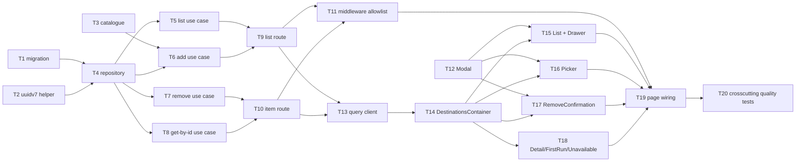

# Epic — dashboard-countries-list

> **Spec:** [spec.md](../spec.md) · **Design:** [sad.md](../sad.md) · **Data model:** [data-model.md](../data-model.md) · **API:** [openapi.yaml](../contracts/openapi.yaml) · **Screens:** [screens.md](../screens.md) · **ADRs:** [adr/](../adr/)

## Goal

Give a Traveler a persistent, curated list of tracked destinations that becomes the app's home and
primary navigation — add, list, open at its own address, and permanently remove one of the five
destinations the app supports, with every change shown only once confirmed (spec §2 Goals).

## Scope

- **In:** the `destinations` module (app/infra/ui), the `tracked_destinations` table, the
  `/api/v1/destinations` API surface, the five-screen manifest, and the two dashboard pages
  (backend-service + web-frontend, per `sad.md` `target_surfaces`).
- **Out:** the app shell itself, choosing a visa type or dates, day-count arithmetic, analytics,
  offline reads/writes, reordering, and an archive/undo for removal (spec §3 Non-goals).

## Task map

## Tasks

See [tracker.md](./tracker.md) for status. Machine contract: [tasks.json](../tasks.json).

| # | Task | Layer | Blocked by | DoD (short) |
|---|---|---|---|---|
| T1 | Promote the staged migration and schema | migration | — | migration applies and reverts cleanly |
| T2 | Shared UUIDv7 id helper | infra | — | ids are valid, time-sortable UUIDv7 |
| T3 | Frozen five-entry destination catalogue | app | — | lookup rejects any unlisted reference |
| T4 | TrackedDestinationsRepository | infra | T1, T2 | ownership-scoped CRUD matches data-model.md |
| T5 | list-tracked-destinations use case | app | T4 | confirmed-empty vs. failed are distinct results |
| T6 | add-tracked-destination use case | app | T3, T4 | unsupported reference refused, writes nothing |
| T7 | remove-tracked-destination use case | app | T4 | not-yours/removed/never-existed identical |
| T8 | get-tracked-destination-by-id use case | app | T4 | same not_found path as T7 |
| T9 | GET/POST /api/v1/destinations route | ports | T5, T6 | responses match openapi.yaml |
| T10 | GET/DELETE /api/v1/destinations/{id} route | ports | T7, T8 | responses match openapi.yaml |
| T11 | Middleware allowlist | wiring | T9, T10 | unauth request rejected pre-handler |
| T12 | Modal primitive | ui | — | focus in/out + Escape; axe clean |
| T13 | Destinations query client | app | T9, T10 | no optimistic cache write |
| T14 | DestinationsContainer | ui | T13 | session-invalid routes ahead of recoverable error |
| T15 | DestinationList + Drawer | ui | T12, T14 | 500-entry operability holds |
| T16 | DestinationPicker | ui | T12, T14 | no optimistic add; inline error on refusal |
| T17 | RemoveConfirmation | ui | T12, T14 | unambiguous not-removed message |
| T18 | Detail/FirstRun/Unavailable | ui | T14 | one error presentation for every non-auth cause |
| T19 | Dashboard page wiring | wiring | T11, T15–T18 | reload/not-yours/unauth all behave per AC-05/06/13 |
| T20 | Cross-cutting quality verification | tests | T19 | ordering equivalence + timing budgets + combined axe pass |

## Risks / Hard rules

- **Sequencing (High, `sad.md §11`):** the app shell must ship first with a header slot and a
  confirmed-sign-out cache clear. Confirm both exist before starting T1 — if either is missing,
  this epic blocks rather than re-absorbing the shell.
- **No optimistic display anywhere** (spec §1, ADR-0005) — T6/T7/T13/T16/T17 must not update the
  cache before the server confirms.
- **Not-yours/removed/never-existed must be indistinguishable** (AC-06, ADR-0008) — T7, T8, T10.
- **No raw SQL outside `src/db/`** (`CLAUDE.md`) — T4 only.
- **Catalogue refusal is app-enforced, not database-enforced** (ADR-0006) — T3, T6.
