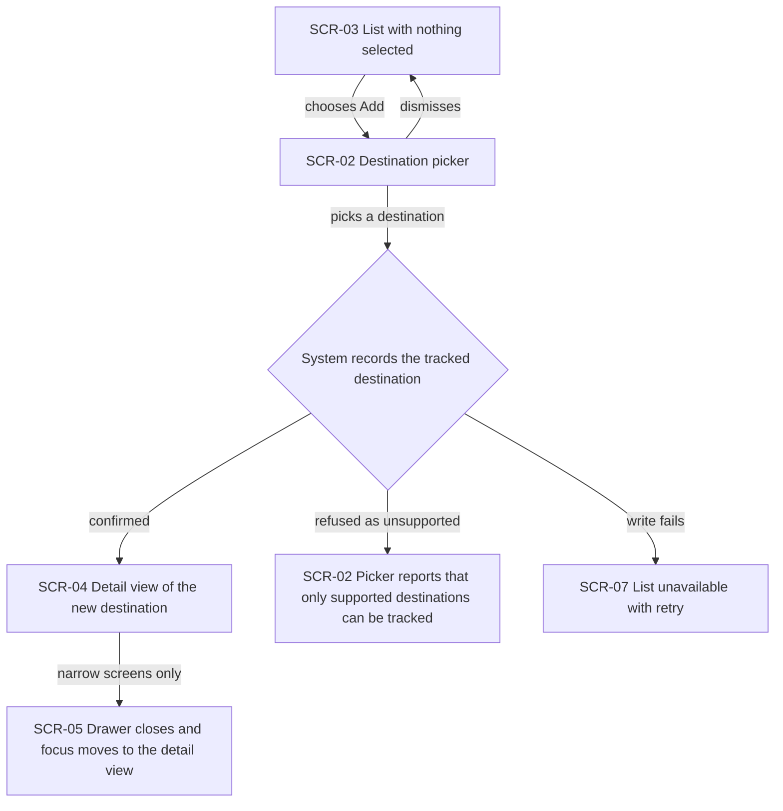
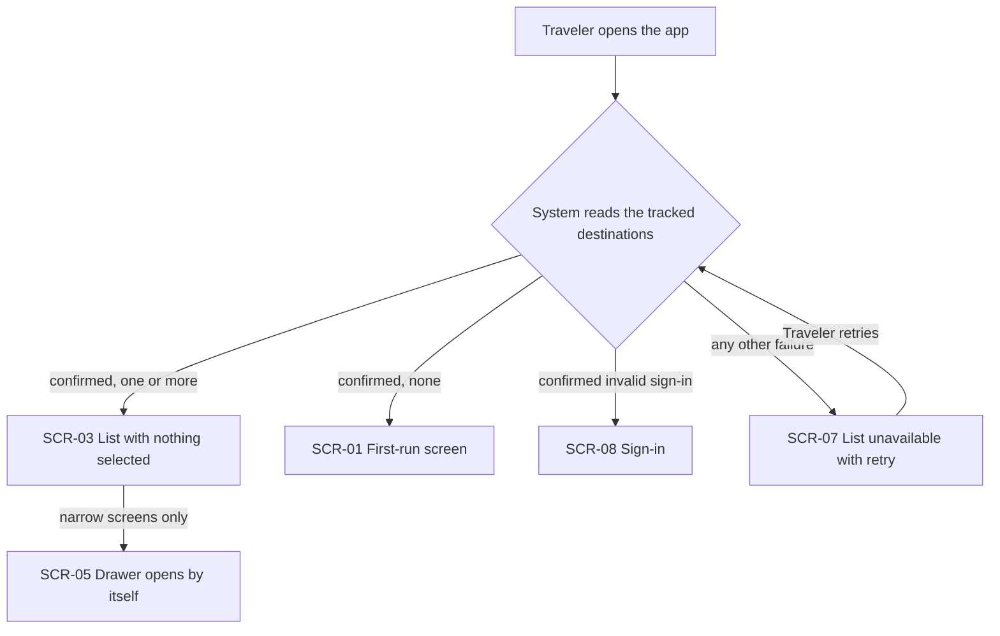
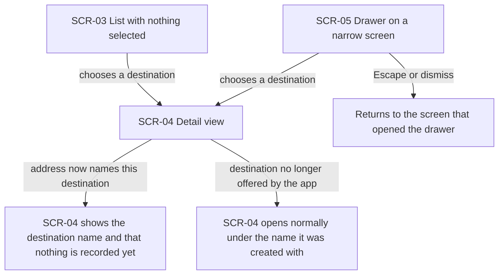
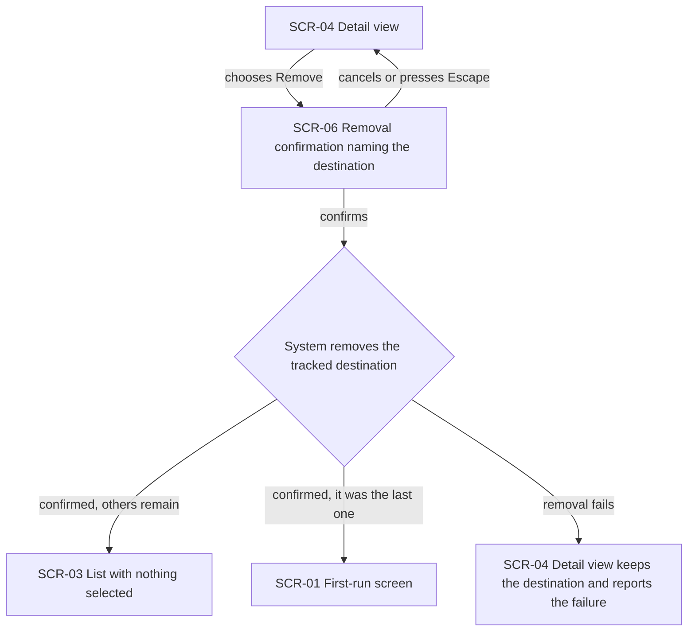
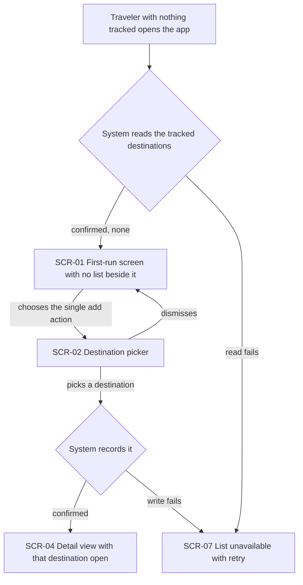
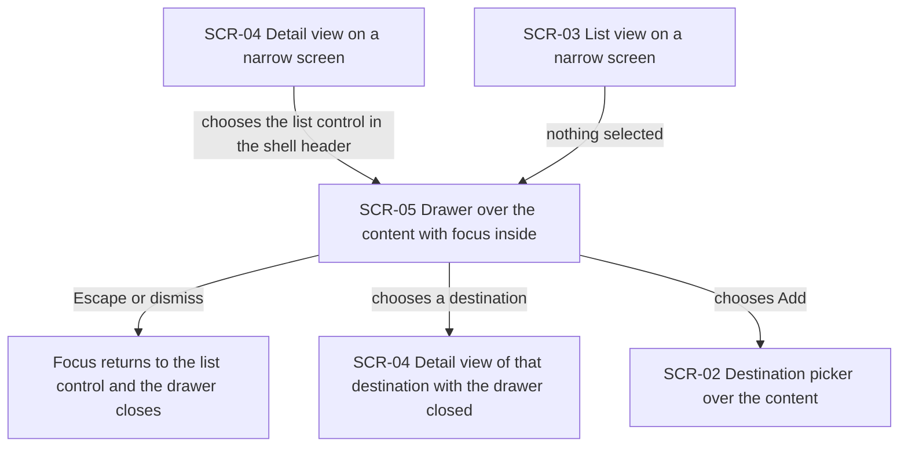
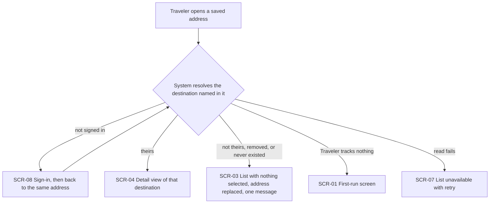

# UX flows — dashboard-countries-list

> User flows for every UI-touching §4 user story, produced by `ux-flows` (after `clarify`, before
> `design`) and read by `design` (evidence for the target-surface + UI-architecture decisions),
> `sequences` (UI-driven flows align on SCR ids), `screens` (details every inventory row) and
> `plan-tests` (the e2e-through-UI paths). Always markdown + mermaid `flowchart` — flow altitude,
> not visual design.

## Platform decisions

- **Posture:** responsive-both — per `docs/design-system.md` §Platform posture; no deviation.
- **Width fork:** at tablet width and up the list sits beside the content and choosing a destination swaps the content in place. Below that the list is behind a control in the app shell's header and opens over the content (SCR-05), closing when a destination is chosen. Three flows fork by width; the rest are identical at both.
- **Modality:** the destination picker (SCR-02) and the removal confirmation (SCR-06) both open over the current view rather than navigating away, so the Traveler never loses their place. Each returns focus to the control that opened it and closes on Escape.
- **Addressability:** the detail view (SCR-04) has its own address carrying the destination's identifier, which is what makes reload, bookmarking and the not-yours branch of US-07 coherent. The list with nothing selected (SCR-03) is the plain home address.
- **Selection:** the system never selects a destination on the Traveler's behalf. Three routes end at SCR-03 — first arrival with no saved address, a rejected address, and removing the destination that was open.
- **Out of scope for these flows:** the app shell's own header and logout (separate feature, ships first — it must provide the header slot SCR-05's control lives in), and sign-in itself (SCR-08, owned by the shipped auth feature; drawn only as an entry and exit point).

## Screen inventory

| ID | Screen | Purpose | Entry | Exit |
|---|---|---|---|---|
| SCR-01 | First-run screen | A Traveler with nothing tracked gets one action: add a first destination. No list beside it. | Opening the app with zero tracked destinations; removing the last one | SCR-02 (add), SCR-08 (sign-out, shell-owned) |
| SCR-02 | Destination picker | The five destinations the app supports, opened over the current view. | The add action on SCR-01, SCR-03, SCR-04 or SCR-05 | SCR-04 on a confirmed add; back to the invoking screen on dismiss |
| SCR-03 | List view, nothing selected | The Traveler's tracked destinations beside a prompt to choose one. The plain home address. | Opening the app with no saved address; a rejected address; removing the open destination | SCR-04 (choose), SCR-02 (add) |
| SCR-04 | Destination detail view | One tracked destination, at its own address. Names the destination and states nothing is recorded for it yet. | Choosing from SCR-03 or SCR-05; a confirmed add; a saved address | SCR-03 (removal, rejection), SCR-06 (remove), SCR-02 (add), SCR-05 (open the list on a narrow screen) |
| SCR-05 | List drawer | The list opened over the content on a narrow screen, with focus inside it. | The list control in the app shell's header; arriving at SCR-03 on a narrow screen | SCR-04 (choose — drawer closes), SCR-02 (add), back to the invoking screen on Escape |
| SCR-06 | Removal confirmation | Names the destination being removed and asks the Traveler to confirm. | The remove action on SCR-04 | SCR-03 or SCR-01 on confirm; back to SCR-04 on cancel or Escape |
| SCR-07 | List unavailable | The tracked destinations could not be read. One message whatever the cause, with a retry control. | Any read of the tracked destinations that fails without a confirmed invalid sign-in | Back to whichever screen the successful retry resolves to |
| SCR-08 | Sign-in | External — owned by the shipped auth feature. Drawn only as an entry and exit point. | No valid sign-in; a sign-in confirmed invalid mid-use | Returns the Traveler to the address they were trying to reach |

## Flows

### Flow: US-01 — Add a tracked destination

A Traveler looking at their list chooses Add and the picker opens over the current view; dismissing it puts them back exactly where they were. Picking a destination sends it to be recorded, and nothing changes in the list until that is confirmed — no optimistic row appears. On confirmation the new destination opens in its own detail view, and it is added even when the Traveler already tracks that same destination, which creates a separate record rather than being refused. On a narrow screen the drawer closes and focus lands on the newly opened detail view, exactly as choosing a destination does. A destination the app does not support is refused with a plain message and nothing is recorded. If the write fails outright, the Traveler lands on the list-unavailable screen with a retry.

### Flow: US-02 — See my tracked destinations

Opening the app reads the Traveler's tracked destinations, and everything downstream depends on that read actually resolving. A confirmed read with one or more records lands on the list with nothing selected — the system never picks a destination on their behalf — with the records in the order the system recorded them, most recent last, ties settled by each record's own identifier so two added moments apart never swap places. A confirmed read with no records is the only route to the first-run screen. A confirmed invalid sign-in sends them to sign in, and takes precedence over the error path. Every other failure — offline, a timeout, an unreadable answer — shows one error presentation with a retry the Traveler may press as often as they like, and nothing retries on its own beforehand. On a narrow screen, arriving with nothing selected opens the drawer by itself so the choice is in front of them.

### Flow: US-03 — Open a tracked destination

Choosing a destination opens its detail view at its own address, which is what makes a reload or a bookmark work later. At tablet width and up the content simply swaps beside the list; on a narrow screen the choice also closes the drawer. The detail view names the destination and says nothing is recorded for it yet — no day-count, no trips, no way to enter either, and no claim about what a later release will add. A destination the app has since stopped offering still opens normally under the name it was created with; it is fully usable and simply cannot be added again.

### Flow: US-04 — Remove a tracked destination

Removal starts from the opened destination's own view, not from a list row — deliberately, so the tap targets in a narrow-screen drawer stay single-purpose. Confirming happens in an overlay the app itself presents, naming the destination being removed, closing on Escape and returning focus to the control that opened it. The list does not change until the removal is confirmed by the system. Afterwards the Traveler is left with nothing selected rather than on a dead view, or back on the first-run screen if that was their last destination. If the removal cannot be completed, the destination stays in the list exactly as it was and one message says plainly that it was not removed — a gap this flow surfaced, now closed by AC-17.

### Flow: US-05 — Start with nothing tracked

A Traveler with nothing tracked lands on a screen of its own — no list rail beside it, one thing to do. The route in matters as much as the screen: it is only reached when the system has actually confirmed the Traveler has nothing, never when the read failed, so nobody is told their list is empty because their connection dropped. The single action opens the picker; dismissing returns to the first-run screen, and a confirmed add takes them straight into the normal list view with that destination open. Removing their last destination brings them back here.

### Flow: US-06 — Use my list on a phone

On a narrow screen the list is never beside the content — it lives behind a control in the app shell's header, which is the one requirement this feature places on the shell. Opening it moves keyboard focus into the drawer; Escape or a dismiss closes it and returns focus to the control that opened it; choosing a destination both opens it and closes the drawer. The add action lives at the end of the list, which on a phone means inside the drawer, and the picker opens over the content from there. Arriving with nothing selected opens the drawer by itself. The same focus contract — focus in on open, back to the invoking control on close, Escape closes — applies to all three surfaces this feature opens over the content: the drawer, the picker and the removal confirmation.

### Flow: US-07 — Come back to where I was

A saved address names one tracked destination, so a reload or a bookmark reopens exactly that one. Three different situations collapse into a single indistinguishable outcome — the address names another Traveler's destination, one this Traveler removed, or one that never existed — all handled by the same path with no early rejection based on the shape of the identifier: nothing is selected, the address is replaced with the plain home address so a reload does not repeat it, and one identical message appears. A visitor who is not signed in is sent to sign in and returned to the address they wanted, where that same rule then applies if it is not theirs. A Traveler who tracks nothing at all lands on the first-run screen instead, and a failed read shows the error with a retry rather than any of the above.

## AC coverage

| AC | Shown by | Notes |
|---|---|---|
| AC-01 happy | Flow US-01 → confirmed branch, and the narrow-screen branch | Includes the duplicate-allowed case and confirmed-before-shown |
| AC-02 error | — | N/A: the criterion is a guarantee the system upholds for any request however it arrives; the picker means no Traveler can reach it by hand. Flow US-01's refused branch shows the reachable remnant only |
| AC-03 happy | Flow US-02 → confirmed branch | Ordering and tie-break stated in the prose account, not as nodes |
| AC-04 happy | Flow US-01 → add entry, Flow US-06 → add from the drawer | The add control's home at both widths |
| AC-05 happy | Flow US-07 → theirs branch | |
| AC-06 authorization | Flow US-07 → not-theirs branch | The three cases are one branch by design — drawing them separately would contradict the criterion |
| AC-07 happy | Flow US-02 → confirmed-with-records branch, Flow US-04 → post-removal branch, Flow US-07 → rejected-address branch | All three routes into the no-selection state |
| AC-08 happy | Flow US-04 → confirm and confirmed branches | |
| AC-09 domain invariant | Flow US-03 → delisted-destination branch | |
| AC-10 happy | Flow US-05, whole flow | Including the return here on removing the last destination |
| AC-11 error | Flow US-02 → other-failure branch, Flow US-05 → read-fails branch | One presentation, repeatable retry, no automatic retry first |
| AC-12 happy | Flow US-06, whole flow | Focus contract extended to all three overlays in the prose account |
| AC-13 authorization | Flow US-07 → not-signed-in branch | Including the return to the requested address after signing in |
| AC-14 cross-context | Flow US-02 → confirmed-invalid-sign-in branch | Precedence over the error branch shown by the branch order; no background polling, so no idle-detection node exists |
| AC-15 cross-context | — | N/A: what the app discards when a sign-out is confirmed is not a movement between screens. Sign-out itself is the app shell's action (Platform decisions), and the next Traveler's own read is Flow US-02 |
| AC-16 happy | Flow US-03 → detail-view branch | |
| AC-17 error | Flow US-04 → removal-fails branch | Criterion added at this stage — the flow surfaced the gap |
