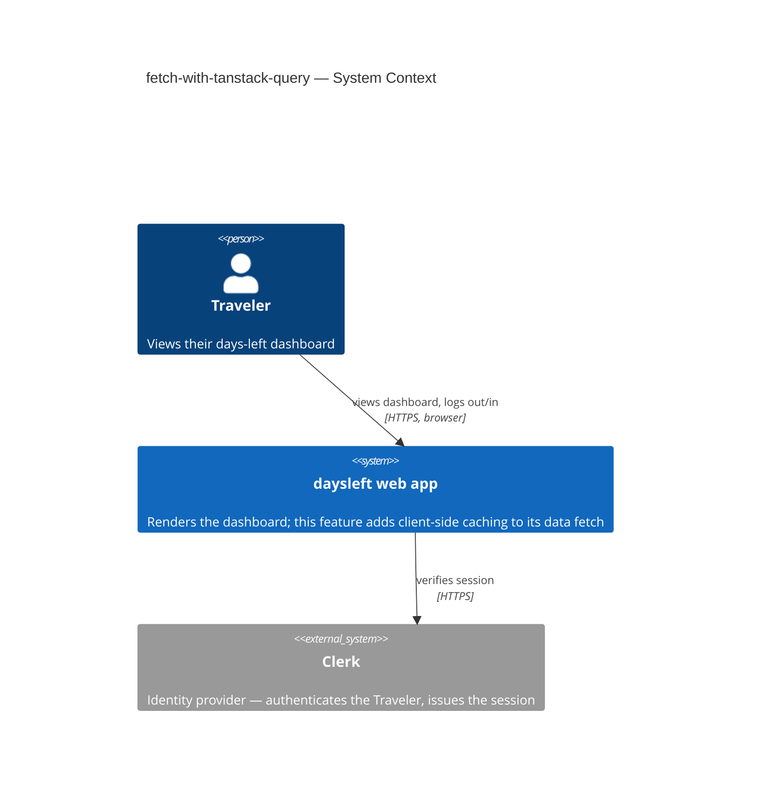
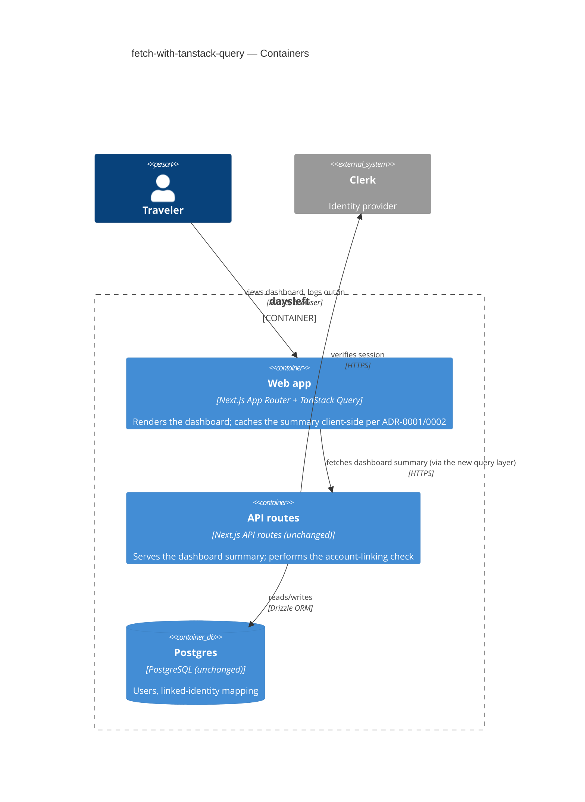
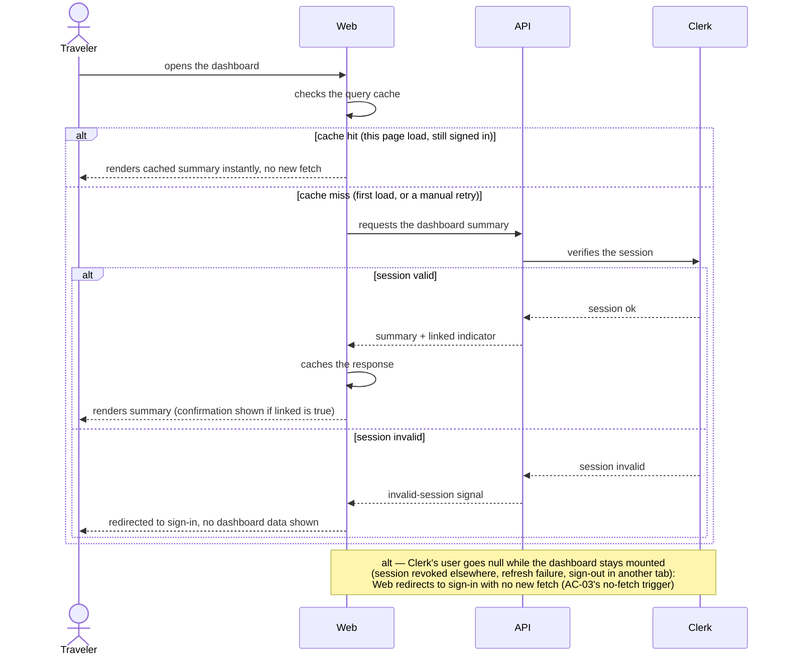
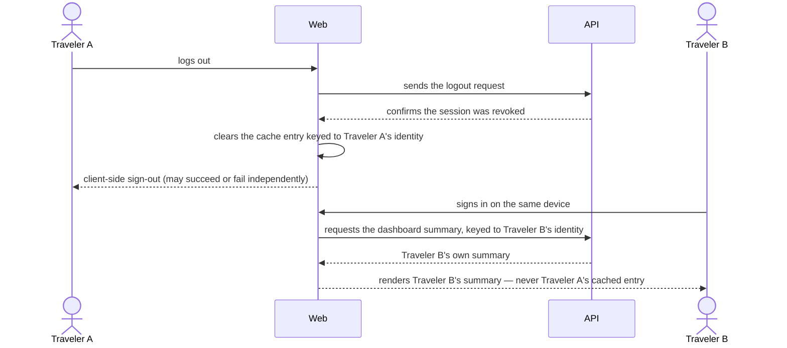
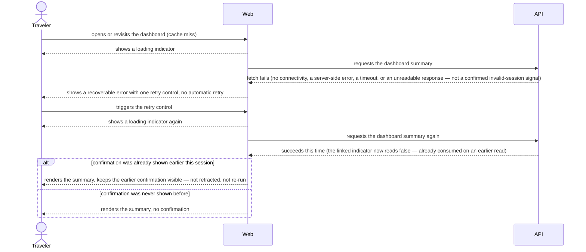

# Software Architecture Document — fetch-with-tanstack-query

## 1. Introduction and goals

**Intent.** The Traveler's days-left dashboard fetches its summary with a hand-rolled `fetch` in a client-side effect: every mount re-issues the request, with no shared cache, no de-duplication, and ad hoc loading/error handling. This feature wraps that one request in a client-side query/cache layer that de-duplicates repeat requests within a page load, gives explicit loading and recoverable-error states, and — because the read carries a one-time "linked" confirmation a naive auto-refetch would corrupt — is configured conservatively (no automatic background revalidation). It also documents the pattern as the convention future modules can copy (spec §2).

**Top-3 quality goals (1-liners; full scenarios in §10):**

1. Correctness of the one-time linked-account confirmation under caching — it must never be silently lost or wrongly re-triggered.
2. Responsiveness — a cache-hit revisit renders instantly with zero duplicate network calls.
3. Security of cached personal data (the Traveler's email) across the sign-out/sign-in identity boundary on a shared device.

**Stakeholders.**

| Role | Interest | Sign-off owner? |
|---|---|---|
| Traveler | Uses the dashboard; sees the loading/error/confirmation states this feature changes | No |
| Backend Lead | Owns the `/api/v1/dashboard` endpoint and its account-linking side effect this feature must not corrupt | No |
| Tech Lead | SAD approval | Yes |
| Security Lead | Reviews the client-side PII-caching abuse cases (spec §6.1: Required) | Yes |

## 2. Constraints

**Technical.**
- TypeScript, Next.js 14.2.5 (App Router)
- React 18, Clerk (`@clerk/nextjs`) for authentication — the project's auth is Clerk, not Auth.js; `docs/architecture-map.md` is stale on this point (confirmed by brownfield scan)
- No TanStack Query dependency exists yet (`@tanstack/react-query` absent from `package.json`) — this feature adds it
- Feature-first module layout: `src/modules/dashboard/{ui,app}` (per [CLAUDE.md](/CLAUDE.md)); actual current modules are `auth/`, `dashboard/`, `sync/` (skeleton), `ui/` — no `trips`/`rules` yet, contrary to the architecture map's greenfield description

**Organisational.**
- Effort budget: XS (per `.size`) — a single PR
- No hard deadline
- Backend Lead owns `session.ts`/`get-dashboard.ts`; Frontend Lead owns `DashboardContainer.tsx`/`DashboardScreen.tsx`

**Conventions.**
- [CLAUDE.md](/CLAUDE.md): unified error envelope `{ error: { code, message } }`, Drizzle ORM only (unaffected — no schema change), Vitest colocated `*.test.ts(x)`, Tailwind CSS
- Existing test convention (confirmed by scan): fetch is mocked via `vi.stubGlobal("fetch", ...)`, no MSW — new tests wrap the component in the query-client provider rather than introducing a mocking library
- [docs/design-system.md](/docs/design-system.md): reuse `src/modules/ui/` components (`Alert`, `Spinner`, `Button`/`LinkButton`) for the new retry affordance — no new primitive

**Regulatory / external.**
- No new personal-data field is introduced; the existing dashboard response (including the Traveler's email) is now additionally held client-side — reviewed as spec §6.1's "Security review: Required"

## 3. Context and scope

The web-frontend (the Next.js app running in the Traveler's browser) renders the dashboard and, today, calls the existing backend-service (`/api/v1/dashboard`, unchanged by this feature) to get the days-left summary; that backend-service in turn checks the Traveler's session with Clerk. This feature changes only how the web-frontend fetches and caches that one response — it introduces no new external dependency and no new backend contract.

<!-- brownfield: confirmed via explorer scan (2026-09-03) — Next.js 14.2.5 App Router, Clerk auth (not Auth.js), modules are auth/dashboard/sync(skeleton)/ui, no TanStack Query dependency yet, no real service worker despite the architecture map's PWA claim. -->

**External systems (in / out):**

| Actor or system | Type | Interaction |
|---|---|---|
| Traveler | Person | Opens/revisits the dashboard, logs out, signs back in |
| daysleft backend-service | System (internal, existing, unchanged) | Serves the dashboard summary; performs the account-linking check |
| Clerk | System (external) | Authenticates the Traveler; issues/validates the session the backend-service checks |

**C4 Context (L1):**



The Traveler interacts only with the daysleft web app; Clerk is the sole external dependency, consulted by the backend-service (not directly by the browser) to verify the Traveler's session. No new external system is introduced.

## 4. Solution strategy

**Target surface: `web-frontend`.** This feature introduces/owns behavior only in the browser-side container — the query/cache layer wrapping the dashboard's existing fetch. It consumes the existing backend-service contract unchanged; no `backend-service` container is declared for this feature (per [ux-flows.md](./ux-flows.md), whose screen inventory is UI-only evidence).

**UI-architecture note (not ADR-worthy — inherited, not new):** the dashboard screen stays client-fetched (CSR) as it already is today; converting it to server-side rendering is an explicit spec non-goal (spec §3). Low blast radius (continuing the status quo, not a new choice) — recorded here inline, no ADR.

**Top strategic choices (the seeds for the two ADRs):**

1. **Adopt TanStack Query, configured conservatively** ([ADR-0001](./adr/0001-adopt-tanstack-query-conservative-refetch.md)) — a client-side query/cache library de-duplicates the dashboard fetch and gives explicit loading/error states (spec Goals 1–2), but because the read carries a one-time "linked" signal a default auto-refetch would corrupt (spec §1), the query is configured with no automatic background revalidation and one manual retry control. Scores 3/3 on the blast-radius gate: irreversible once other modules copy it, multi-module by declared intent (spec Goal 3), and has legitimate alternatives (SWR, a hand-rolled cache, RSC-only).
2. **Scope the cache by Traveler identity and clear it on logout** ([ADR-0002](./adr/0002-scope-cache-by-identity-clear-on-logout.md)) — the cached response includes the Traveler's email (spec §6.1 confidential classification); the cache is keyed by the signed-in Traveler's identity and cleared the moment the logout response confirms the server revoked the session, so a different Traveler signing in on the same device can never read a prior entry (spec AC-05). Borderline on the gate but decided as its own ADR given the security stakes.

Each tactical decision in §5–§8 traces to one of these two seeds.

## 5. Building block view

Feature-first module layout (per [CLAUDE.md](/CLAUDE.md)): the query/cache layer lives inside `src/modules/dashboard/`, alongside the screen it serves — no shared "hooks" grab-bag folder. The one cross-module addition is the query-client provider, which by necessity wraps the whole app (a React context provider must sit above every component that uses it) and is added to the existing root layout next to `ClerkProvider`.

**Internal decomposition:**

```
src/
├── app/
│   └── layout.tsx              # adds the query-client provider (root, wraps children inside ClerkProvider)
└── modules/
    └── dashboard/
        ├── ui/
        │   └── DashboardContainer.tsx   # migrated from useEffect+fetch to the query hook
        └── app/
            ├── get-dashboard.ts         # unchanged — existing handler, no contract change
            └── dashboard-query.ts       # the dashboard query's key, fetcher, and conservative options — app logic, not UI
```

**C4 Container (L2):**



Only the Web app container changes: it gains a query-client provider and a query definition for the dashboard summary. The API routes container and Postgres are drawn for context but are unmodified by this feature.

## 6. Runtime view

**Critical flow 1: Open the dashboard (cache miss, then a cache hit)**



**Critical flow 2: Logout clears the cache for the next Traveler (ADR-0002)**



This is where ADR-0002's identity-scoping decision actually lives: even if the clear in step 4 and Traveler B's sign-in raced, Traveler B's fetch is keyed to a different identity and could never read Traveler A's entry.

**Critical flow 3: Recover from a fetch failure and retry**



The Traveler's first fetch fails for a reason other than a confirmed invalid session — network, server, timeout, or an unreadable response — and sees a recoverable error with a single retry control they must trigger themselves; nothing retries automatically. Triggering it shows the loading indicator again and re-fetches. If the Traveler's linked-account confirmation was already shown earlier this session, it stays visible even though this retry's response no longer carries the flag — the confirmation is never silently retracted by a later fetch.

Together, the three flows carry QG-1 and part of QG-2 (flow 1), QG-3 (flow 2), and the rest of QG-1/QG-2 plus the error/retry path (flow 3).

**Coverage.**

Every spec §4 user story maps to at least one flow:

| User story | Flow(s) |
|---|---|
| US-01 (avoid duplicate fetches) | Flow 1 — cache-hit branch |
| US-02 (clear loading state) | Flow 1 — cache-miss branch (implicit); Flow 3 — explicit loading steps |
| US-03 (recover from a network error) | Flow 3 |
| US-04 (sent to sign in on session expiry) | Flow 1 — session-invalid branch |
| US-05 (never see another account's dashboard) | Flow 2 |
| US-06 (linked-confirmation trustworthy) | Flow 1 — success branch; Flow 3 — durability `alt` branch |

Every spec §5 acceptance criterion is shown by a flow or an explicit branch — none is runtime-N/A:

| AC | Shown by |
|---|---|
| AC-01 (happy) | Flow 1, "cache hit" branch |
| AC-02 (error) | Flow 3, main path |
| AC-03 (authorization) | Flow 1, "session invalid" branch; Flow 1's no-fetch `alt` note (user goes null while mounted) |
| AC-04 (domain invariant) | Flow 1, success branch (confirmation shown); Flow 3, `alt` branch (confirmation survives a retry) |
| AC-05 (cross-context) | Flow 2, entire flow |
| AC-06 (happy — loading state) | Flow 1, cache-miss branch (implicit); Flow 3, explicit loading steps |

## 7. Deployment view

<!-- N/A: reuses the existing deployment unit (the Next.js app), no infra change — no new service, no new datastore, no new environment. -->

## 8. Crosscutting concepts

| Concept | Convention | Where defined |
|---|---|---|
| Authentication | Clerk session cookie + `clerkMiddleware`, unchanged by this feature | `src/middleware.ts` |
| Error handling | Existing unified envelope `{ error: { code, message } }` from the API (unchanged); the client-side query layer splits the confirmed-invalid-session branch from every other failure per spec AC-02/AC-03 | [CLAUDE.md](/CLAUDE.md); spec §5 |
| Caching | TanStack Query, no automatic background revalidation (no refetch on window focus/reconnect, no automatic retry), cache retained for the page load's lifetime, scoped by Traveler identity, cleared on server-confirmed logout | [ADR-0001](./adr/0001-adopt-tanstack-query-conservative-refetch.md), [ADR-0002](./adr/0002-scope-cache-by-identity-clear-on-logout.md) |
| ID strategy | N/A — no new persisted entity | — |
| Internationalisation | New UI strings (the retry control's label, etc.) added to the existing catalog | `src/lib/i18n/en.json` |
| Observability | Test assertions in CI only this pass — no new production telemetry (spec §3 non-goal) | spec §6/§7 |
| Events | N/A — no event/message-based communication in this feature | — |

## 9. Architecture decisions

| # | Title | Status | Section |
|---|---|---|---|
| 0001 | Adopt TanStack Query with a conservative refetch policy | Accepted | §4 |
| 0002 | Scope the dashboard's client cache by Traveler identity and clear it on logout | Accepted | §4 |

ADR files live under `docs/features/fetch-with-tanstack-query/adr/`.

## 10. Quality requirements

**QG-1. One-time linked-confirmation correctness**
- **When:** a Traveler who was just linked to an existing account triggers any later fetch in the same sign-in session (a cache-hit revisit, or an explicit retry after a failure)
- **Then:** the confirmation, once shown, remains visible for the rest of the sign-in session even if a later fetch's response no longer carries the flag (spec §6 "One-time flag integrity")
- **How verify:** test assertion in CI — the confirmation stays visible across a repeat mount/focus and across an AC-02 retry whose response omits the flag (spec §6 measurement, verbatim)

**QG-2. Responsiveness / duplicate-fetch avoidance**
- **When:** a Traveler revisits the dashboard within the same page load while still signed in
- **Then:** 0 extra network calls per revisit within the same page load, for as long as the Traveler stays signed in — a reload starts fresh (spec §6 "Duplicate-fetch avoidance", verbatim); latency p95 on the dashboard's first load ≤ 500 ms (spec §6 row 1, verbatim); the cached entry is never evicted or treated as stale before sign-out or page unload — no time-based expiry (spec §6 "Cache retention", verbatim)
- **How verify:** test assertion in CI pinning the fetch call count across a repeat mount/focus; test assertion in CI for the latency target; test assertion in CI for the retention rule (staleTime/gcTime configuration + a repeat-access test) (spec §6 measurements)

**QG-3. Cached-PII security across the identity boundary**
- **When:** a Traveler logs out and a different Traveler subsequently signs in on the same device
- **Then:** the new Traveler's dashboard never displays the previous Traveler's cached summary, even momentarily (spec AC-05, verbatim)
- **How verify:** test asserting the cache is cleared on the server-confirmed logout response and is keyed by Traveler identity (spec §6.1 abuse-case mitigation)

## 11. Risks and technical debt

| Risk / debt | Severity | Mitigation | Owner | Due |
|---|---|---|---|---|
| Stale-authorization display: with auto-revalidation disabled, cached summary data keeps rendering after a session is invalidated elsewhere until the Traveler triggers a real fetch again | Medium | Accepted and bounded by spec AC-03 — any actual fetch always re-checks the session; no cached data is ever served as if still valid | Backend Lead | — (accepted, not scheduled) |
| The dashboard endpoint's one-time `linked` flag stays fragile (only true on the first read) rather than persisted server-side | Low | Constrained via ADR-0001's conservative refetch config for this pass; revisit if the endpoint is changed to persist linked state | Backend Lead | — (accepted, not scheduled) |
| Open architectural decision: should the endpoint persist `linked` state instead of a one-shot flag, so automatic revalidation can be safely enabled later? | Open question | See spec §8 OQ2 | Backend Lead | Before any future feature proposes enabling auto-refetch |
| Open architectural decision: should a shared query-key convention/registry be defined before a second module adopts this pattern? | Open question | See spec §8 OQ1; ADR-0002's Neutral consequence notes the same gap for identity-scoped keys specifically | Tech Lead | Before the next feature adds a second cached query |

**Accepted debt (acceptable in v1, plan to fix later):**
- The one-shot `linked` flag's fragility is worked around client-side (persisting the shown-confirmation state across fetches) rather than fixed server-side — acceptable because the underlying write is already safe to repeat (spec §1); revisit per the open question above.

## 12. Glossary

| Term | Meaning |
|---|---|
| Traveler | A person tracking their own visa day-counts; one account = one traveler (see root [CONTEXT.md](/CONTEXT.md)) |
| Sign-in session | The period a Traveler is authenticated, bounded by sign-in/sign-out; for client-side cache state, also bounded by the current page load (see root [CONTEXT.md](/CONTEXT.md)) |
| Linked (confirmation) | The one-time "signed in to your existing account" indicator shown when a Traveler's identity was just linked to an existing account; true only on the first read after linking |
| Dashboard summary | The days-left data the dashboard screen displays; the response this feature's cache holds |
