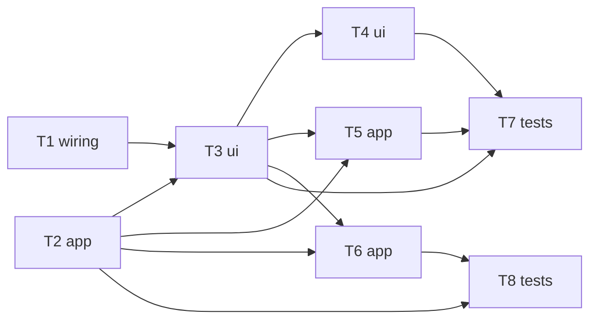

# Epic — fetch-with-tanstack-query

> **Spec:** [spec.md](../spec.md) · **Design:** [sad.md](../sad.md) · **Screens:** [screens.md](../screens.md) · **ADRs:** [adr/](../adr/)

## Goal

Replace the dashboard's hand-rolled `useEffect`+`fetch` with a TanStack Query-backed cache: de-duplicate repeat requests within a page load, give explicit loading/recoverable-error states, and do it safely against a read endpoint that performs a write and returns a one-shot confirmation flag (spec §2 Goals).

## Scope

- **In:** the `web-frontend` surface only — `src/app/layout.tsx` (provider), `src/modules/dashboard/{app,ui}/` (query definition + container migration + retry control + confirmation durability + logout cache-clear), their tests.
- **Out:** any backend/endpoint change, any other module's fetch, server-side rendering, production telemetry, a shared cross-module query-key registry (spec §3 non-goals).

## Task map

## Tasks

See [tracker.md](./tracker.md) for status. Machine contract: [tasks.json](../tasks.json).

| # | Task | Layer | Blocked by | DoD (short) |
|---|---|---|---|---|
| T1 | Add TanStack Query dependency and root provider | wiring | — | Provider renders, no runtime error |
| T2 | Define the dashboard query (conservative, identity-scoped) | app | — | Options + key unit-tested |
| T3 | Migrate DashboardContainer to the query hook | ui | T1, T2 | AC-01/03/06 behavior preserved |
| T4 | Add the retry control to the error state | ui | T3 | AC-02 retry control, no auto-retry |
| T5 | Preserve the linked confirmation across a later fetch | app | T2, T3 | AC-04 durability |
| T6 | Clear the identity-scoped cache on logout | app | T2, T3 | AC-05 clear + identity scoping |
| T7 | Test DashboardContainer/DashboardScreen | tests | T3, T4, T5 | AC-01/02/03/04/06 covered |
| T8 | Test dashboard-query cache config + logout clear | tests | T2, T6 | AC-05, NFR rows covered |

## Risks / Hard rules

- The dashboard's read endpoint performs an account-linking write and returns a one-shot `linked` flag ([spec §1](../spec.md)) — no task may enable automatic background revalidation (window-focus/reconnect refetch, automatic retry). T2 sets this in the query options; T3/T4 must not override it.
- The 401-vs-network-error split (AC-03 vs AC-02) is an existing, tested behavior — T3 must preserve it exactly, not collapse both into one `isError` branch.
- Cache clearing on logout (T6) must not be conditioned on the client-side `signOut()` call succeeding — only on the server's logout response ([ADR-0002](../adr/0002-scope-cache-by-identity-clear-on-logout.md)).
