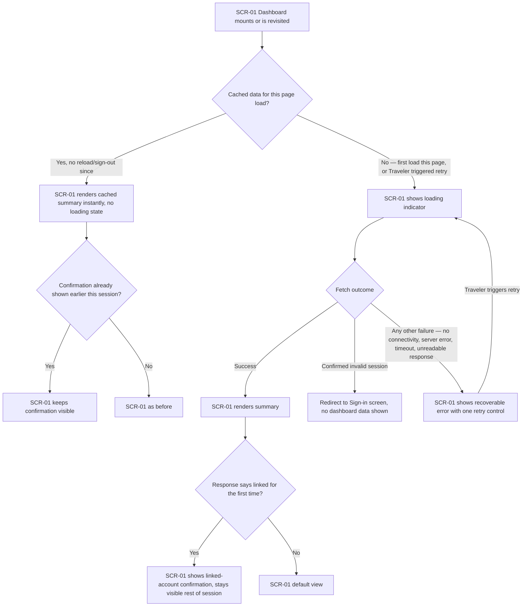
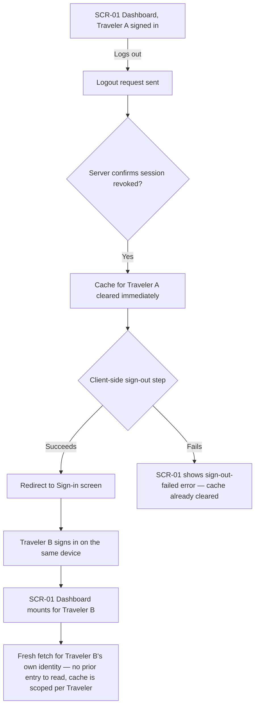

# UX flows — fetch-with-tanstack-query

> User flows for every UI-touching §4 user story in [spec.md](./spec.md). Read by `design`
> (target-surface evidence), `sequences` (SCR alignment), `screens` (details each inventory row)
> and `plan-tests` (e2e-through-UI paths).

## Platform decisions

- **Posture:** responsive-both — per [docs/design-system.md](/docs/design-system.md), no per-feature deviation.
- No new navigation shape or modality: this feature changes only how the existing Dashboard screen fetches and caches its data, not how the Traveler moves between screens.
- US-01, US-02, US-03, US-04, and US-06 are drawn as **one consolidated flow** — they are all branches of the same "open/revisit the dashboard" journey, sharing one entry screen. US-05 (logout → a different Traveler signs in) is a genuinely separate journey and gets its own flow. Every AC is still individually mapped in the AC-coverage table below.

## Screen inventory

| ID | Screen | Purpose | Entry | Exit |
|---|---|---|---|---|
| SCR-01 | Dashboard | Shows the Traveler's days-left summary (loading / default / error / linked-confirmation states) | Post sign-in redirect, tab revisit, page reload, or a new Traveler's post-sign-in redirect after a prior logout | Sign-in screen (session-expired redirect, or after a successful logout) — external, owned by the `auth-user-plus-dashboard` feature |

## Flows

### Flow: US-01 / US-02 / US-03 / US-04 / US-06 — Open or revisit the dashboard

The Traveler lands on or returns to the dashboard. If this page load already has the summary cached (a tab-switch, a re-mount — not a sign-out or a browser reload), it renders instantly with no loading flicker and no new network call (AC-01); if the linked-account confirmation was already shown earlier in this session it stays visible regardless of this revisit (part of AC-04). Otherwise — the first load of this page, or the Traveler explicitly triggering the retry control after a failure — the dashboard shows a loading indicator (AC-06) while it fetches. A successful fetch renders the summary; if this is the first read after the Traveler's identity was linked to an existing account, the confirmation appears and, once shown, stays visible for the rest of the sign-in session even if a later fetch's response no longer carries the flag (AC-04). A fetch that comes back with a confirmed invalid-session signal sends the Traveler to sign-in with no dashboard data shown (AC-03) — distinct from every other failure (no connectivity, a server-side error, a timeout, an unreadable response), which instead shows a recoverable error with a single retry control the Traveler must trigger themselves; nothing retries automatically (AC-02), and triggering it returns to the loading state.

### Flow: US-05 — Logout clears the dashboard for the next sign-in

Traveler A logs out; as soon as the logout request's response confirms the server revoked the session, the cached dashboard data is cleared — this does not wait on or depend on the client-side sign-out step, which may itself still fail and show its own error. When Traveler B later signs in on the same device, the dashboard mounts fresh: because the cache is scoped to the signed-in Traveler's identity as well as cleared at logout, Traveler B's fetch can never read an entry Traveler A left behind, even momentarily (AC-05).

## AC coverage

| AC | Shown by | Notes |
|---|---|---|
| AC-01 | Flow US-01/02/03/04/06 → node B "Yes" → C | Cache-hit revisit, no loading state, no new call |
| AC-02 | Flow US-01/02/03/04/06 → node E "Any other failure" → H, loop back to D on retry | Recoverable error + single manual retry control |
| AC-03 | Flow US-01/02/03/04/06 → node E "Confirmed invalid session" → G | Redirects to Sign-in, no dashboard data shown |
| AC-04 | Flow US-01/02/03/04/06 → nodes C1/C2 and F1/F2 | Confirmation shown once, stays visible rest of session across cache-hit revisits and later fetches |
| AC-05 | Flow US-05 → nodes C/D and H/I/J | Cache cleared on server-confirmed logout; scoped per Traveler identity |
| AC-06 | Flow US-01/02/03/04/06 → node D | Loading indicator on first load or on a retry |
